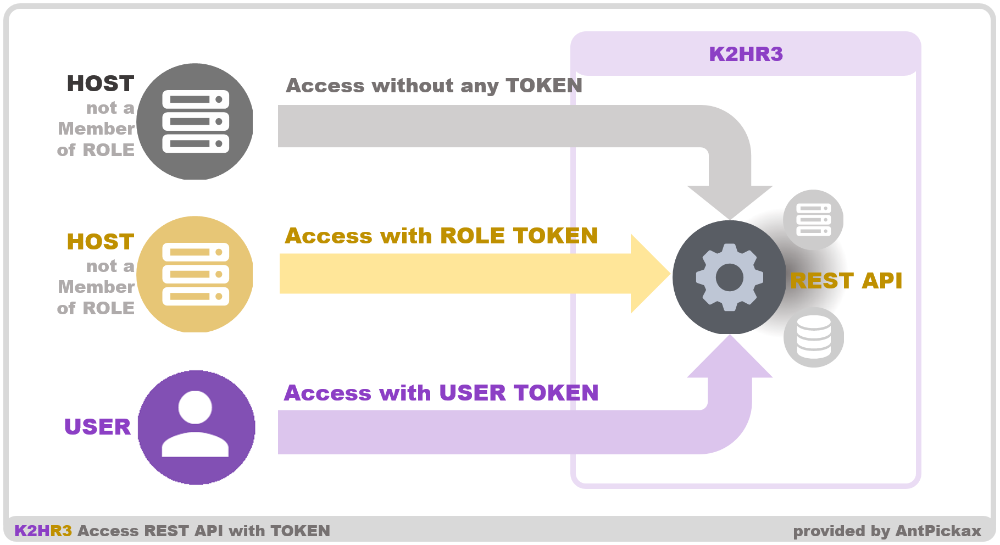

# K2HR3 REST API

This page provides general information of K2HR3 REST API. K2HR3 REST API is a K2HR3 RESTful HTTP service. The primary purposes of K2HR3 REST API are as followings:

* Provides interfaces for internal subsystems to communicate with each other
  * K2HR3 Web application, Web servers and K2HR3 OpenStack Notification Listener consume K2HR3 REST API to cooperate with each other.
* Provides interfaces for the outside world for cloud orchestration
  * +SERVICE functionality for service owner's systems. They invokes K2HR3 REST API to validate service members and create their resources to their systems.
  * [cloud-init](https://cloudinit.readthedocs.io/en/latest/index.html), which is a script to initialize an instance, is an example. It invokes K2HR3 REST API to configure the instance as it boots into the cloud system and integrates itself with K2HR3.

## Token
This chapter describes a token, which is a string that represents the authenticated identity of an **USER**(OpenStack users or other any user authentication system users) or a K2HR3 ROLE member.

K2HR3 REST API accepts tokenless requests and requests with a token for usability. Clients must send requests with necessary parameters in right places correctly, so that K2HR3 REST API identify the type of a request. See each API page for details.

### Token Types

This section describes the two token types; USER TOKEN and ROLE TOKEN.  

USER TOKEN is a token that represents the authenticated identity of an OpenStack user or other any user authentication system user.
The K2HR3 TOKEN API generates this type of token for a authenticated user.
A token is scoped to K2HR3 TENANT, which is a nearly equal OpenStack project, or unscoped.
K2HR3 REST APIs find this type of token to determine the access authority scope of each operation to the target resources by the authenticated user.  

ROLE TOKEN is a token that represents the authenticated identity of a K2HR3 ROLE member. The K2HR3 ROLE API generates this type of token. K2HR3 REST APIs use this type of token to determine the access authority scope of each operation to the target resources by the K2HR3 ROLE member.

### Request patterns of K2HR3 REST API

Primary request patterns of K2HR3 REST API are:

* A tokenless request
  * This pattern is the primary feature of K2HR3.
  * Hosts belonging to a K2HR3 ROLE use this request pattern when they have access to their own resources
* A request with a USER TOKEN
  * For example, users who play with the Web application primarily use this request pattern.
* A request with a ROLE TOKEN
  * For example, hosts that not yet belong to a role use this request pattern when they need to have access to the resource that is owned by the role.

## K2HR3 REST APIs

The following sections describe each K2HR3 API. The primary usage of K2HR3 system doesn't always require a token. However, in some cases you need a token. See each API pages for the details.

### [VERSION API](api_version.html)

The purpose of the VERSION API is to list all versions, endpoints and methods in the [K2HR3](index.html) REST APIs.

### [TOKEN API](api_token.html)

The purpose of the TOKEN API is to create a token and show details for a token and validate a token. A token is a string generated for authorization to permit access to a [K2HR3](index.html) environment. The [K2HR3](index.html) REST APIs accept both a request with a token and a tokenless request to restricted resources. As of a request with a token, clients must send each request with a token in the right place correctly, so that the K2HR3 REST APIs can identify the type of a request. See the each API page for details.

### [LIST API](api_list.html)

The purpose of the LIST API is to list available K2HR3 SERVICEs, K2HR3 RESOURCEs, K2HR3 ROLEs and K2HR3 POLICIes. Each element is in [YRN](detail_various.html) form. See the [Service Usage](usage_service.html) for the K2HR3 SERVICEs, K2HR3 RESOURCEs, K2HR3 ROLEs and K2HR3 POLICIes.

### [ROLE API](api_role.html)

The purpose of the ROLE API is to create and update and get and delete a K2HR3 ROLE. See the [Basic Usage](usage_base.html) about the K2HR3 ROLE in the K2HR3.

### [RESOURCE API](api_resource.html)

The purpose of the RESOURCE API is to create and update and get and delete a K2HR3 RESOURCE. See the [Basic Usage](usage_base.html) about the K2HR3 RESOURCE.

### [POLICY API](api_policy.html)

The purpose of the POLICY API is to define and list ACLs associated with K2HR3 RESOURCES. ACLs determine K2HR3 RESOURCE usage. Each ACL consists of a group of actions(READ, WRITE and EXECUTE) over a K2HR3 RESOURCE and a permission(ALLOW or DENY) to the group of actions. See the [Basic usage](usage_base.html) page about how to apply K2HR3 POLICIes to K2HR3 ROLE's members.

### [SERVICE API](api_service.html)

The purpose of the SERVICE API is for a K2HR3 TENANT(as same as OpenStack tenant(or project) when cooperated with OpenStack) to create, show details, update, and delete a information of the K2HR3 SERVICEs of the K2HR3 TENANT. Therefore, each method requires a token scoped to a K2HR3 TENANT scoped token. See the [+SERVICE Usage](usage_service.html) page for the K2HR3 SERVICE details.

### [ACR(ACCESS CROSS ROLE) API](api_acr.html)

The purpose of the ACR API is to provide the +SERVICE functionality. See the [Service Usage](usage_service.html) for the +SERVICE details.

### [USERDATA API](api_userdata.html)

The purpose of the USER DATA API is to provide USER DATA, which user defined data to customize a cloud instance, to [cloud-init](https://cloudinit.readthedocs.io/en/latest/) that initializes OpenStack instances. [cloud-init](https://cloudinit.readthedocs.io/en/latest/) reads the user data defined by K2HR3 by calling this K2HR3 USER DATA API. The content contains two types of data, a config file for [cloud-init](https://cloudinit.readthedocs.io/en/latest/) and a shell script. [cloud-init](https://cloudinit.readthedocs.io/en/latest/) runs the shell script to pass the instance meta data(primarily including the unique id and the IP address) by using K2HR3 ROLE API. See the [Detail](detail.html) page for K2HR3's collaboration with OpenStack.

