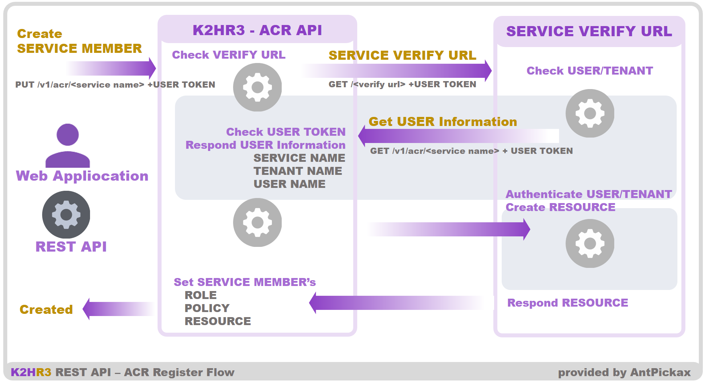
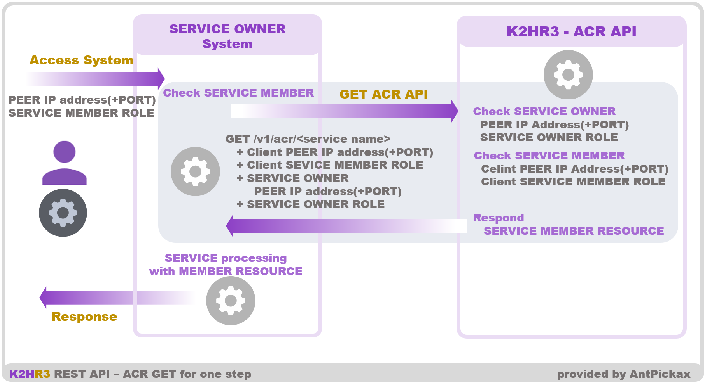

# ACR API

K2HR3 REST APIの+サービス（+SERVICE）機能で利用するACR(ACCESS CROSS ROLE)に関連するAPI群です。

## POST
サービス（SERVICE）の利用側（MEMBER）としてテナント（TENANT）を紐付けます。（**yrn:yahoo:_service name_::_tenant name_** を作成します。）  
紐付けられるテナント（TENANT）には、**acr_role**、**acr_policy**と、サービス（SERVICE）所有側（OWNER）から設定されたリソース（RESOURCE）が自動的に作成されます。  
_このリソース（RESOURCE）は所有側（OWNER）がサービス（SERVICE）に設定した値（VERIFY URLの値、もしくはREST APIのレスポンスの値）です。_  
作成時には、Unscoped User Token、Scoped User Tokenのいずれかを指定することができます。  

### 動作（詳細）
事前にサービス（SERVICE）所有側（OWNER）によりテナント（TENANT）が利用側（MEMBER）として登録されている必要があります。  
作成は、以下のように動作します。（VERIFY URLとしてリソース（RESOURCE）が登録されている場合）
- ACR APIが呼び出される
- 各Tokenから、テナント（TENANT）にScopedされた Scoped User Tokenが新規に作成される
- K2HR3システムから、上記のScoped User Tokenを伴い、サービス（SERVICE）のVERIFY URLが呼び出される
- VERIFY URL側では、受け取ったScoped User Tokenを転送する（ACR APIのGETを呼び出し、ユーザ（USER）、利用側（MEMBER）テナント（TENANT）、サービス（SERVICE）を受け取ります）
- VERIFY URL側で、ユーザ（USER）、利用側（MEMBER）テナント（TENANT）、サービス（SERVICE）に基づいたリソース（RESOURCE）データを作成する
- VERIFY URL側で作成したリソース（RESOURCE）データが、K2HR3システムに返される
- 受け取ったリソース（RESOURCE）データが、サービス（SERVICE）利用側（MEMBER）として紐付けられるテナント（TENANT）に設定される

上記のフローによりサービス（SERVICE）利用側（MEMBER）としてテナント（TENANT）が紐付けられます。  
VERIFY URLがURL以外の場合には、途中処理（VERIFY URLの呼び出し）が省略され、VERIFY URLに設定されている値を固定値としてリソース（RESOURCE）に設定します。

このフローを下記の図に示します。  


### VERIFY URLに渡されるトークン（TOKEN）について
VERIFY URLに渡されるScoped User Tokenは、上述のフロー処理中のみ有効であるワンタイムのトークン（TOKEN）となります。  
ACR APIのGETが呼び出された時点で、このトークン（TOKEN）は削除され、利用できなくなります。

### Endpoint(URL)
http(s)://_API SERVER:PORT_/v1/acr/_service name_

### Header
#### Unscoped User Token時
```
Content-Type: application/json
x-auth-token: U=<Unscoped User Token>
```
#### Scoped User Token時
```
Content-Type: application/json
x-auth-token: U=<Scoped User Token>
```
### Request Body
#### Unscoped User Token時
```
{
    "tenant":  <tenant name>
}
```
- tenant  
サービス（SERVICE）利用側（MEMBER）に紐付けるテナント（TENANT）名を指定します。  
本APIにより、Unscoped User Tokenから、このテナント（TENANT）にScopeされた Scoped User Tokenが生成されます。

#### Scoped User Token時
なし

### Response status
201、40x

### Response Body(JSON)
```
{
    result:     <true/false>
    message:    <null or error message string>
}
```

- result  
APIの処理結果をtrue/falseで返します。
- message  
処理結果がfalse（失敗）のときに、エラーメッセージが格納されます。


## PUT
サービス（SERVICE）の利用側（MEMBER）としてテナント（TENANT）を紐付けます。（**yrn:yahoo:_service name_::_tenant name_** を作成します。）  
紐付けられるテナント（TENANT）には、**acr_role**、**acr_policy**と、サービス（SERVICE）所有側（OWNER）から設定されたリソース（RESOURCE）が自動的に作成されます。  
_このリソース（RESOURCE）は所有側（OWNER）がサービス（SERVICE）に設定した値（VERIFY URLの値、もしくはREST APIのレスポンスの値）です。_  
作成時には、Unscoped User Token、Scoped User Tokenのいずれかを指定することができます。  

### Endpoint(URL)
http(s)://_API SERVER:PORT_/v1/acr/_service name_  
http(s)://_API SERVER:PORT_/v1/acr/_service name_?_urlarg_

### Header
#### Unscoped User Token時
```
Content-Type: application/json
x-auth-token: U=<Unscoped User Token>
```
#### Scoped User Token時
```
Content-Type: application/json
x-auth-token: U=<Scoped User Token>
```
### URL Arguments
#### Unscoped User Token時
- tenant=_tenant name_  
サービス（SERVICE）利用側（MEMBER）に紐付けるテナント（TENANT）名を指定します。  
本APIにより、Unscoped User Tokenから、このテナント（TENANT）にScopeされた Scoped User Tokenが生成されます。

#### Scoped User Token時
なし

### Response status
201、40x

### Response Body(JSON)
```
{
    result:     <true/false>
    message:    <null or error message string>
}
```

- result  
APIの処理結果をtrue/falseで返します。
- message  
処理結果がfalse（失敗）のときに、エラーメッセージが格納されます。

## GET
本メソッドには、2つの機能があり、それぞれの利用用途があります。
それぞれの機能と用途（目的）を以下に説明します。

### Scoped User Tokenの情報を取得する
本ACR APIのPUT（POST）メソッドのサービス（SERVICE）利用側（MEMBER）のテナント（TENANT）を紐付ける処理のときに呼び出されることを想定したエントリポイントです。  
_本メソッドを直接ユーザ（USER）や外部システムが利用することはありません。_  

本ACR APIのPUT（POST）メソッドの内部処理において、サービス（SERVICE）所有側（OWNER）がVERIFY URLを設定していた場合、この内部処理はVERIFY URLを呼び出します。  
このVERIFY URLに対してリクエストを送信するとき、ワンタイムScoped User Tokenが自動的に付加されます。  
VERIFY URL側では、このトークン（TOKEN）の確認と、トークン（TOKEN）に紐づけられたユーザ（USER）などの情報を取得します。  

本メソッドは、このワンタイムScoped User Tokenの確認を行い、ユーザ（USER）情報を返します。

### サービス（SERVICE）利用側（MEMBER）のリソース（RESOURCE）を取得する
本メソッドは、サービス（SERVICE）利用側（MEMBER）に登録されている全リソース（RESOURCE）を取得します。  

[+サービス（+SERVICE）機能による連携（２）](usage_rbacja.html)に示すユースケース、サービス（SERVICE）の所有側（OWNER）のシステムが認証・認可をK2HR3システムに委譲する時に呼び出されるAPIです。

これは、サービス（SERVICE）利用側（MEMBER）が、サービス（SERVICE）所有側（OWNER）のシステムにアクセスするとき（前提としてこのシステムでは利用側（MEMBER）固有のリソース（RESOURCE）が必要とする）、K2HR3システムから利用側（MEMBER）のリソース（RESOURCE）を取得せず、直接所有側（OWNER）システムにアクセスすることを目的として提供されるAPIです。  
つまり、利用側（MEMBER）固有のリソース（RESOURCE）を所有側（OWNER）のシステムがK2HR3システムから代理で取得するフローになります。  
これにより、利用側（MEMBER）は、所有側（OWNER）が提供した固有のリソース（RESOURCE）を知る必要がありません。  
利用側（MEMBER）固有のリソース（RESOURCE）は、所有側（OWNER）が提供したものですが、所有側（OWNER）システムにアクセスするとき、事前に利用側（MEMBER）はそのリソース（RESOURCE）を取得する必要がありません。  

本メソッドは、所有側（OWNER）が利用側（MEMBER）の代理として、利用側（MEMBER）のサービス（SERVICE）へのアクセス確認、および固有リソース（RESOURCE）の取得を行うためのAPIです。  

このフローを以下に示します。
- [事前条件] サービス（SERVICE）所有側（OWNER）と利用側（MEMBER）が設定されており、利用側（MEMBER）のロール（ROLE）に利用側（MEMBER）のシステムのクライアントホスト（HOST）が登録されている
- 利用側（MEMBER）のクライアントホスト（HOST）が所有側（OWNER）システムにアクセスする  
_アクセスするとき、クライアントホスト（HOST）が登録されている利用側（MEMBER）ロール（ROLE）の[YRN](detail_variousja.html)パスと、必要であればクライアントホスト（HOST）を識別するためのポート番号を一緒に渡します_
- 所有側（OWNER）システムは、このリクエストのパラメータに加えて、所有側（OWNER）システムが登録されているロール（ROLE）と必要であればポート番号を付与して、**本メソッドにアクセス**します
- 本メソッドは渡されたパラメータにより、利用側（MEMBER）クライアントホスト（HOST）、所有側（OWNER）システムの確認をします
- 双方のアクセスが認可された場合、利用側（MEMBER）に登録されている固有リソース（RESOURCE）を所有側（OWNER）システムに返します
- 所有側（OWNER）システムは返された固有リソース（RESOURCE）を使って独自の処理を行い、結果を利用側（MEMBER）のクライアントホスト（HOST）に返します

このフローを以下の図に示します。


側（MEMBER）クライアントホスト（HOST）が属するロール（ROLE）です。  
この値はクライアントホスト（HOST）から指定された値を所有側（OWNER）システムが転送します。
- ccuk=_client container unique key_  
この値は現在reservedです。
- sport=_service port_  
所有側（OWNER）システムのホスト（HOST）を特定するためのポート番号です。（不要であれば指定しません）  
_所有側（OWNER）システムのIPアドレスは、本メソッドシステム側でPEERのIPアドレスとして認識されますので、指定しません。_
- srole=_service role yrn path_  
所有側（OWNER）システムのホスト（HOST）が属するロール（ROLE）です。
- scuk=_service container unique key_  
この値は現在reservedです。

### Response status
200、40x

### Response Body(JSON)
#### Scoped User Tokenの情報を取得する
```
{
    result:     <true/false>
    message:    <null or error message string>
    tokeninfo = {
        user:   <user name>
        tenant: <tenant name>
        service:<service name>
    }
}
```
- result  
処理結果をtrue/falseで返します。
- message  
処理結果がfalse（失敗）のときに、エラーメッセージが格納されます。
- tokeninfo:user  
指定したScoped User Tokenのユーザ名を返します
- tokeninfo:tenant  
指定したScoped User TokenのTENANTを返します
- tokeninfo:service  
サービス（SERVICE）名を返します

#### サービス（SERVICE）利用側（MEMBER）に設定された全リソース（RESOURCE）を取得する
```
{
    result:     <true/false>
    message:    <null or error message string>
    response:   [
        {
            name:       <resource name>
            expire:     <expire>
            type:       <resource type>
            data:       <resource data>
            keys:       {
                foo:    bar
                ...
            }
        },
        ...
    ]
}
```
- result  
APIの処理結果をtrue/falseで返します。
- message  
処理結果がfalse（失敗）のときに、エラーメッセージが格納されます。
- response  
サービス（SERVICE）利用側（MEMBER）に設定された全リソース（RESOURCE）を返します

## DELETE
サービス（SERVICE）所有側（MEMBER）に登録されている利用側（MEMBER）のテナント（TENANT）を削除します。  
テナント（TENANT）のScoped User Tokenを指定します。

### Endpoint(URL)
http(s)://_API SERVER:PORT_/v1/acr/_service name_

### Header
```
Content-Type: application/json
x-auth-token: U=<Scoped User Token>
```

### Response status
204、40x

### Response Body(JSON)
なし
