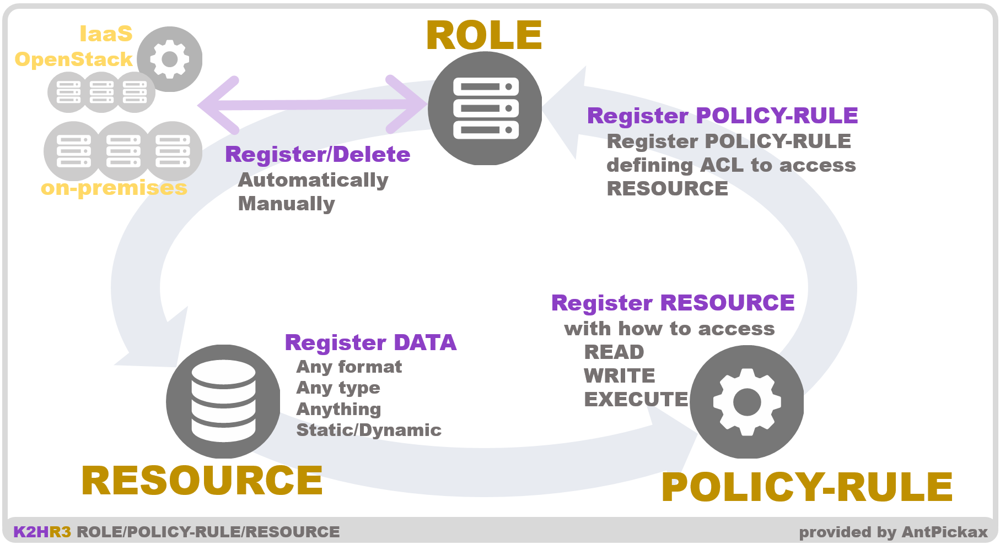
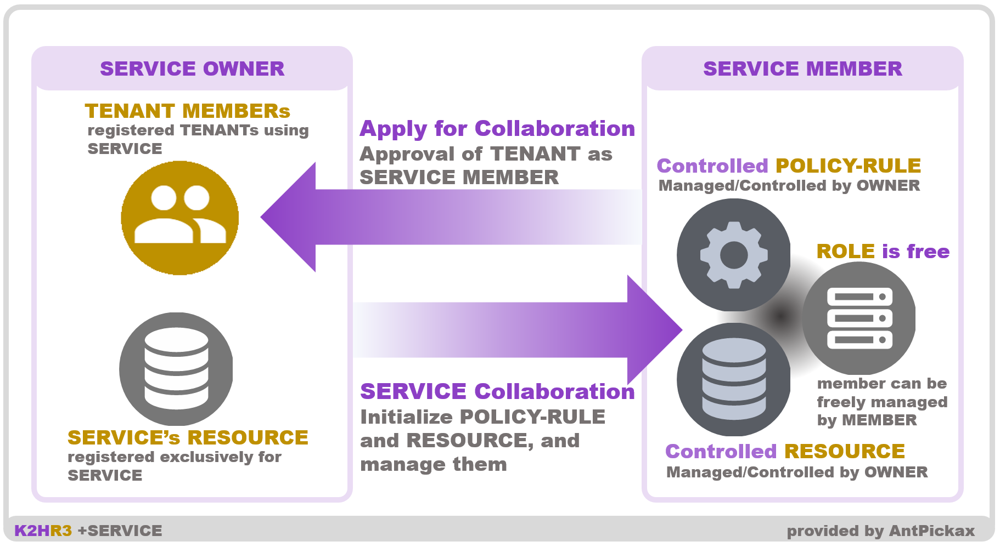
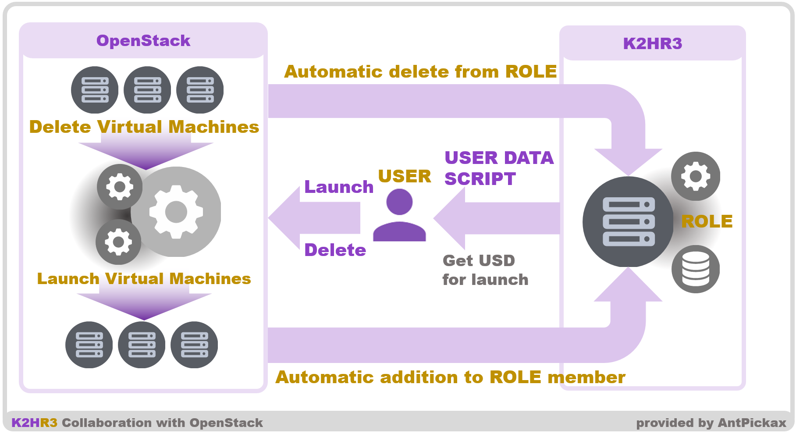
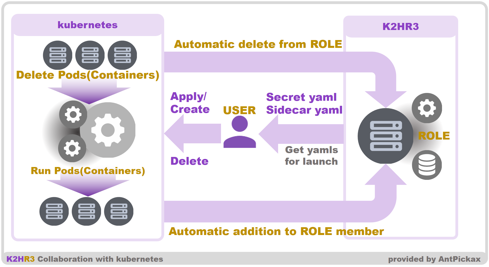
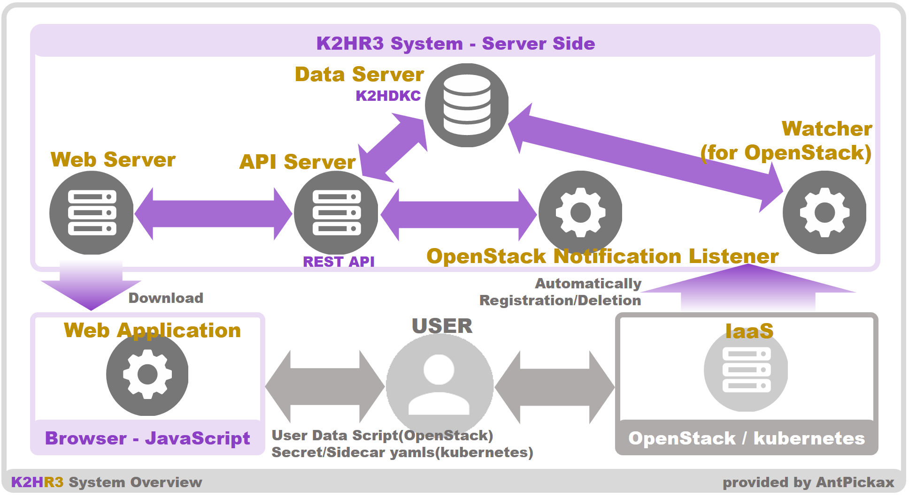

# 詳細
K2HR3 の仕様およびシステム構成について説明します。  
K2HR3 の概要は、[概要](homeja.html)、[特徴](featureja.html)を参照してください。

# ユーザ（USER）とテナント（TENANT）
K2HR3システムは、ユーザ（USER）とテナント（TENANT）の管理はせず、K2HR3システムと連携させたユーザ管理システムを使います。  
例えば、OpenStackと連携させている場合、Openstackのユーザとテナント（もくはプロジェクト）をK2HR3のユーザ（USER）とテナント（TENANT）として利用します。  
OpenStack以外のユーザ管理システムの場合、個々のユーザ管理システムに対応させた追加プログラムを準備し、K2HR3システムに設定し、K2HR3のユーザ（USER）とテナント（TENANT）として定義します。  

## OpenStackと連携する場合
ユーザ（USER）とテナント（TENANT）および連携するOpenStackのイメージを以下に示します。  

### ユーザ（USER）とログイン
K2HR3 の利用者をユーザ（USER）と定義します。  

K2HR3 のユーザは、K2HR3と連携するOpenStackのユーザです。  
OpenStackと連携する場合、既存のOpenStackへのログインユーザがそのままK2HR3で利用できます。  

K2HR3でログインする場合、OpenStack Identity サービス (Keystone) を使用しています。  
連携するOpenStack Identity サービス (Keystone) のユーザであれば、K2HR3をすぐに利用できます。

### テナント（TENANT）
テナント（TENANT）は、K2HR3と連携するIaaS（OpenStack）のテナント（もしくはプロジェクト）と同じになります。  
これは、K2HR3が連携するIaaS（OpenStack）のテナント（もしくはプロジェクト）と同期して動作するためです。  

K2HR3のユーザ（USER）は、OpenStack OpenStack Identity サービス (Keystone) でグルーピングされているOpenStackのテナント（もしくはプロジェクト）に自動的に紐付けされます。

## OpenStack以外の場合
OpenStack以外の場合、お使いのユーザ認証システムと連携するためのコードを準備し、K2HR3システムに設定します。  
_kubernetesの場合（OpenStackを利用していない場合）には、この項目を参照してください。_

### 準備
お使いのユーザ認証システムと連携するためのコードを準備する必要があります。  
コードの内容は、[k2hr3_app/routes/lib/userValidateCredential.js](https://github.com/yahoojapan/k2hr3_app/blob/master/routes/lib/userValidateCredential.js)や、[k2hr3_app/routes/lib/userValidateDebug.js](https://github.com/yahoojapan/k2hr3_app/blob/master/routes/lib/userValidateDebug.js)を参考にして作成できます。  

### 設定
専用のコードを[K2HR3 Web Application](usage_app.html) (k2hr3_app)を展開している **routes/lib**ディレクトリに配置します。  
次に、このファイル名（拡張子**.js**なし）を**config**ディレクトリの**conf**ファイルに記述する**'validator'**に設定してください。

### 動作
上記の設定により、K2HR3 Web Appilicationのログイン（Siginin）ダイアログからログインができるようになります。  
_詳細については、今後ドキュメントを拡充していきます。_

# ロール（ROLE）・ポリシー/ルール（POLICY）・リソース（RESOURCE）
ロール（ROLE）、ポリシー/ルール（POLICY）およびリソース（RESOURCE）の関係を以下の図に示します。  

## ロール（ROLE）
K2HR3のロール（ROLE）とは、リソース（RESOURCE）へのアクセスをするグループを定義したものです。  
ユーザ（USER）が、リソース（RESOURCE）へのアクセスの種類別、グループ別にロール（ROLE）を登録します。  
ロール（ROLE）は、テナント（TENANT）に紐付き、テナント（TENANT）別に定義します。  

ロール（ROLE）は、リソース（RESOURCE）にアクセスするメンバーの入れ物（グルーピングされたもの）です。  
このメンバーとは、K2HR3の[REST API](apija.html)サーバーにアクセスするホスト（HOST）であり、オンプレミスおよびIaaS（OpenStackやkubernetes）で管理される仮想コンピューティング（Virtual Machine）、ポッド/コンテナー（Pods/Containers）です。  
ロール（ROLE）のメンバーは、ホスト（HOST）のIPアドレス他が登録されます。  

ロール（ROLE）のメンバー登録は、K2HR3の連携するOpenStackの仮想コンピューティング（Virtual Machine）もしくはkubernetesのポッド/コンテナー（Pods/Containers）の作成に連動して、自動的に登録できます。  
自動的に登録したメンバーは、OpenStackからの仮想コンピューティング（Virtual Machine）もしくはkubernetesのポッド/コンテナー（Pods/Containers）の削除に連動して、自動的に登録が抹消されます。  
また、K2HR3の[Webアプリケーション](usage_appja.html)からロール（ROLE）のメンバーをユーザ（USER）の手動入力で登録/削除することもできます。  

## ポリシー/ルール（POLICY）
ポリシー/ルール（POLICY）とは、リソース（RESOURCE）へのアクセス方法を定義したものです。  
ポリシー/ルール（POLICY）は、テナント（TENANT）に紐付き、テナント（TENANT）別に定義します。  
リソース（RESOURCE）へのアクセス方法には、以下の3つの種別があらかじめ定義されています。
- 読み出し（READ）
- 書き込み（WRITE）
- 実行（EXECUTE）  
_現在まだ提供されていません。_

ユーザ（USER）は、ポリシー/ルール（POLICY）をこの規則を適用する対象のリソース（RESOURCE）と共に、上記の3つの種別を組み合わせて定義します。  
つまり、K2HR3システムは、リソース（RESOURCE）へのアクセスは、ポリシー/ルール（POLICY）を指定して行うことで、そのリソース（RESOURCE）へのアクセス制御を行います。  

## リソース（RESOURCE）
リソース（RESOURCE）とは、ユーザ（USER）が自由に定義できる任意のデータです。  
リソース（RESOURCE）は、テナント（TENANT）に紐付き、テナント（TENANT）別に定義します。  
リソース（RESOURCE）には、テキストデータ、バイナリデータ（REST APIから指定します）を設定でき、あらゆるデータを設定できます。  

たとえば、リソース（RESOURCE）にロール（ROLE）メンバーであるホスト（HOST）上で動作するアプリケーション（プログラム）が必要とする個別のデータ（設定情報等々）を設定できます。  
また、それらプログラムが利用するTokenデータ、証明書なども設定できます。  

リソース（RESOURCE）に設定するデータは、K2HR3システムが提供するテンプレートエンジン（後述）により展開されるテンプレート（TEMPLATE）データも設定できます。  
このテンプレート（TEMPLATE）により、動的に変化するリソース（RESOURCE）を定義でき、状況に応じたリソース（RESOURCE）を提供できます。  

### テンプレート（TEMPLATE）
テンプレート（TEMPLATE）とは、K2HR3システムが提供する[K2HR3 テンプレートエンジン](usage_templateja.html)により展開されるリソース（RESOURCE）を定義したテキストデータです。  
テンプレート（TEMPLATE）には、K2HR3システムにユーザ（USER）が登録したリソース（RESOURCE）、ロール（ROLE）などを指定し、その内容を展開する命令を記述できます。  
また、単純な四則演算や条件文を記述できます。  
このテンプレート（TEMPLATE）を[K2HR3 テンプレートエンジン](usage_templateja.html)がロードし、その内容を展開することで、動的なリソース（RESOURCE）を提供できます。  
K2HR3テンプレートエンジンの使い方は、[K2HR3 テンプレートエンジン](usage_templateja.html)を参照してください。

# サービス（SERVICE）の連携について
サービス（SERVICE）の連携のイメージを以下に示します。  

## サービス（SERVICE）
**+サービス**（**+SERVICE**）機能とは、K2HR3システムの中でテナント（TENANT）もしくはロール（ROLE）間を跨ぐリソース（RESOURCE）の提供を行うための機能です。
**+サービス**（**+SERVICE**）機能で使うサービス（SERVICE）は、テナント（TENANT）に紐付き、テナント（TENANT）別に定義します。  

サービス（SERVICE）は、その機能の所有側（OWNER）と利用側（MEMBER）が定義されています。  
所有側（OWNER）とは、リソース（RESOURCE）を提供する側であり、利用側（MEMBER）とは、リソース（RESOURCE）を利用する側です。  

## 用途・目的
**+サービス**（**+SERVICE**）機能の目的は、異なるテナント（TENANT）間でリソース（RESOURCE）提供する上での連携機能を提供することです。  
リソース（RESOURCE）の所有側（OWNER）の役割は、利用側（MEMBER）のテナント（TENANT）を登録し、リソース（RESOURCE）へのアクセスを許可するだけです。  
リソース（RESOURCE）の利用が許可されたテナント（TENANT）は、そのテナント（TENANT）内で自由にリソース（RESOURCE）にアクセスできるロール（ROLE）とそのメンバーを定義できます。  

つまり、所有側（OWNER）は、提供するリソース（RESOURCE）の内容、アクセス方法を制御でき、アクセスする利用側（MEMBER）をテナント（TENANT）単位で管理できます。  
利用側（MEMBER）は、提供されるリソース（RESOURCE）にアクセスするロール（ROLE）を管理し、ロール（ROLE）メンバーのホスト（HOST）を管理します。  

# IaaS（OpenStack、kubernetes）連携
K2HR3システムは、IaaS（OpenStackおよびkubernetes）と連携し、K2HR3システムでのユーザ（USER）、テナント（TENANT）を連携します。  
_kubernetesの場合には、kubernetesに提供されているユーザ認証システムとの連携が必要です。_
この連携により、OpenStackのユーザ、テナント（もしくはプロジェクト）が対応することで、利用者への負担を軽減し、また簡単にシステム導入を可能とします。  

また、K2HR3システムは、IaaS（OpenStackおよびkubernetes）と連携し、ロール（ROLE）メンバーの自動的な登録・削除ができます。  
ロール（ROLE）メンバーの自動的な登録・削除の連携は以下に説明するように実行されます。  

## ロール（ROLE）メンバーの自動登録
K2HR3は、OpenStackの仮想コンピューティング（Virtual Machine）もしくはkubernetesのポッド/コンテナー（Pods/Containers）の作成に連動し、自動的にロール（ROLE）メンバーへ作成したホスト（HOST）を追加できます。  

### OpenStackの場合
OpenStackの場合、自動登録を行うために仮想コンピューティング（Virtual Machine）の作成時にUser Data Scriptを指定します。  
ここで指定するUser Data Scriptは、K2HR3システム（Webアプリケーション）から取得した小さなテキストデータです。
User Data Scriptのテキストデータは、作成するホスト（HOST）を追加したいロール（ROLE）を指定して、取得することができます。
取得したUser Data Scriptのテキストデータを仮想コンピューティング（Virtual Machine）作成時に指定するのみです。

### kubernetesの場合
kubernetesの場合は、ポッド（Pods）起動時に、**Secret** の設定とPodsに**Sidecar**を指定し、起動します。  
**Secret**および**Sidecar**のためのyamlサンプルコードは、[K2HR3 Web Application](usage_app.html)から取得することができます。  
取得したyamlサンプルコードを、起動時のyamlへ反映させ、ポッド（Pods）を起動してください。

## ロール（ROLE）メンバーの自動削除
### OpenStackの場合
K2HR3は、OpenStackで仮想コンピューティング（Virtual Machine）の削除に連動し、自動的にロール（ROLE）メンバーからそのホスト（HOST）を削除できます。  
対象のホスト（HOST）がOpenStackで作成され、自動的にロール（ROLE）にメンバーとして登録されている場合、OpenStackからその仮想コンピューティング（Virtual Machine）を削除するだけで自動的にメンバーから削除できます。  

この機能は、K2HR3の提供する[K2HR3 OpenStack Notification Listener](detail_osnlja.html)で実装されています。  
ユーザ（USER）は[K2HR3 OpenStack Notification Listener](detail_osnlja.html)プログラムを予め設定・起動しておくことで、自動削除の機能を利用できます。  
このプログラムの仕様・利用方法については、[K2HR3 OpenStack Notification Listener](detail_osnlja.html)を参照してください。

### kubernetesの場合
kubernetesの場合もOpensStackと同様に、ポッド/コンテナー（Pods/Containers）の削除に連動し、自動的にロール（ROLE）メンバーからそのポッド/コンテナー（Pods/Containers）を削除できます。  
対象のポッド/コンテナー（Pods/Containers）がK2HR3システムと連動し、自動的に登録されていれば、ポッド/コンテナー（Pods/Containers）を削除するだけで自動的にメンバーから削除されます。  

## OpenStackにおけるロール（ROLE）メンバーの定期確認と自動削除
OpenStackとの連携において、K2HR3システムのK2HR3 OpenStack Notification Listenerを起動できない場合であっても、自動的にロール（ROLE）メンバーからそのホスト（HOST）を削除できます。  
この削除は、K2HR3システムに内包されている Watcher プログラムを使って、実現されています。  
Watcherプログラムは、IaaS（OpenStack）連携により自動的に登録されたロール（ROLE）メンバーのホスト（HOST）の実在確認を定期的にチェックし、削除されていた場合に自動的に登録を削除します。  
K2HR3システムのK2HR3 OpenStack Notification Listenerを起動できない場合であっても、この Watcher プログラムを起動しておくことで、同等の自動削除が提供されます。  

Watcherプログラムの仕様・利用方法については、[ツール](toolsja.html)を参照してください。  

## ロール（ROLE）メンバーの自動登録・削除
### OpenStackの場合
OpenStackにおけるロール（ROLE）メンバーの自動登録・削除について、以下の図に概要を示します。  

### kubernetesの場合
kubernetesにおけるロール（ROLE）メンバーの自動登録・削除について、以下の図に概要を示します。  

# K2HR3システム
K2HR3システムの全体概要図を以下に示します。  

K2HR3システムは、上記の図に示すように、Webアプリケーション、Webサーバー、APIサーバー、データーサーバー（K2HDKC）、K2HR3 OpenStack Notification Listener、Watcherのサブシステムで構成されています。  
各々のサブシステムの説明を以降に示します。  

## K2HR3 Webアプリケーション
Webアプリケーションは、K2HR3のユーザ（USER）がブラウザを通してアクセスし、K2HR3システムのコントロールパネルとして動作します。  
JavaScriptベースで作成されたWebアプリケーションであり、ユーザ（USER）が必要とするK2HR3システムに登録された全てのデータの操作ができます。  
ユーザ（USER）は、このWebアプリケーションを使い、ロール（ROLE）、ポリシー/ルール（POLICY）、リソース（RESOURCE）、サービス（SERVICE）を操作できます。  

このWebアプリケーションの使い方については、[K2HR3 Webアプリケーションの使い方](usage_appja.html)を参照してください。  
_K2HR3 Webアプリケーションは、[React.js](https://reactjs.org/)を使って、作成されています。_  

K2HR3 Webアプリケーションのソースコードは、[k2hr3_app Githubリポジトリ](https://github.com/yahoojapan/k2hr3_app)にあり、[k2hr3 Githubリポジトリ](https://github.com/yahoojapan/k2hr3)のサブモジュールとしても登録されています。  

## K2HR3 Webサーバー
Webサーバーは、ユーザ（USER）がWebアプリケーションを利用するためにアクセスするWebサーバーです。  
このWebサーバーから、WebアプリケーションのJavaScriptがブラウザにロードされ、実行されます。  
_Webサーバーは、Server Side JavaScriptであり、[Node.js](https://nodejs.org/)を使って動作します。_  

K2HR3 Webサーバーのソースコードは、[k2hr3_app Githubリポジトリ](https://github.com/yahoojapan/k2hr3_app)にあり、[k2hr3 Githubリポジトリ](https://github.com/yahoojapan/k2hr3)のサブモジュールとして登録されています。  

## K2HR3 APIサーバー
APIサーバーは、データーサーバー（K2HDKC）に存在するロール（ROLE）、ポリシー/ルール（POLICY）、リソース（RESOURCE）、サービス（SERVICE）などのデータを操作するためのREST APIを提供します。  
このAPIサーバーを通して、Webアプリケーション/Webサーバーとデーターサーバー（K2HDKC）が通信を行います。  
また、ユーザ（USER）やロール（ROLE）に登録されているホスト（HOST）が、このAPIサーバーのREST APIを直接呼出し、リソース（RESOURCE）などのデータを読み出し、書き込みを行います。  
APIサーバーおよびREST APIについては、[K2HR3 REST API](apija.html)を参照してください。  
_REST APIおよびAPIサーバーは、Server Side JavaScriptであり、[Node.js](https://nodejs.org/)を使って動作します。_  

K2HR3 APIサーバーのREST APIのソースコードは、[k2hr3_api Githubリポジトリ](https://github.com/yahoojapan/k2hr3_api)にあり、[k2hr3 Githubリポジトリ](https://github.com/yahoojapan/k2hr3)のサブモジュールとして登録されています。  

## K2HR3 データーサーバー（K2HDKC）
データーサーバー（K2HDKC）は、K2HR3システムで管理するロール（ROLE）、ポリシー/ルール（POLICY）、リソース（RESOURCE）、サービス（SERVICE）などを保管、管理するサーバーです。  
このデーターサーバーは、[AntPickax](https://antpick.ax/indexja.html)が提供する分散KVSである[K2HDKC](https://k2hdkc.antpick.ax/indexja.html)で構築されています。  

K2HR3システムで利用している分散KVSについては、[K2HDKC](https://k2hdkc.antpick.ax/indexja.html)を参照してください。

## K2HR3 OpenStack Notification Listener
これは、K2HR3システムで利用する K2HR3 OpenStack Notification Listener であるサーバー（プログラム）です。  
OpenStackと連携し、仮想コンピューティング（Virtual Machine）削除の検出、およびロール（ROLE）へのメンバーから対象のホスト（HOST）の自動削除を行います。  

このプログラムにの使い方については、[K2HR3 OpenStack Notification Listener](detail_osnlja.html)を参照してください。  
K2HR3 OpenStack Notification Listenerのソースコードは、[k2hr3_osnl Githubリポジトリ](https://github.com/yahoojapan/k2hr3_osnl)にあり、[k2hr3 Githubリポジトリ](https://github.com/yahoojapan/k2hr3)のサブモジュールとして登録されています。  

## K2HR3 Watcher
Watcherは、USERがK2HR3 OpenStack Notification Listenerを利用できない場合、仮想コンピューティング（Virtual Machine）削除の監視、およびロール（ROLE）メンバーから対象のホスト（HOST）の自動削除ができる代替プログラムです。  

このプログラムの使い方については、[Watcher](toolsja.html)を参照してください。  
K2HR3 Watcherのソースコードは、[k2hr3_api Githubリポジトリ](https://github.com/yahoojapan/k2hr3_api)にあり、[k2hr3 Githubリポジトリ](https://github.com/yahoojapan/k2hr3)のサブモジュールとして登録されています。  

# 詳細（その他）
上述以外のK2HR3システムの共通の仕様、その他の詳細について、[詳細（その他）](detail_variousja.html)で説明します。

