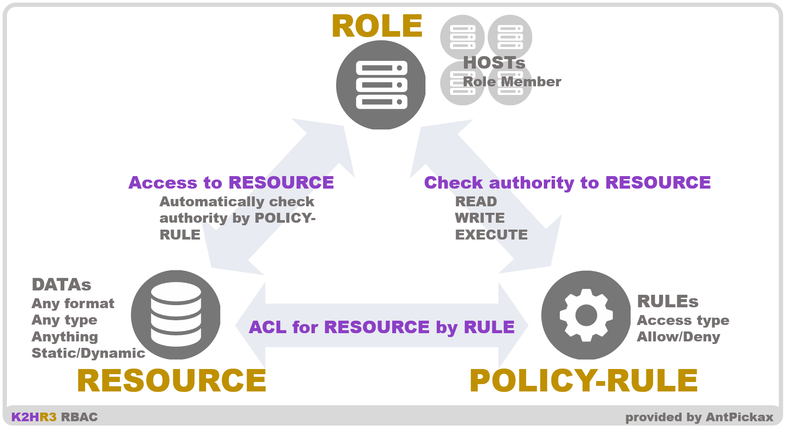
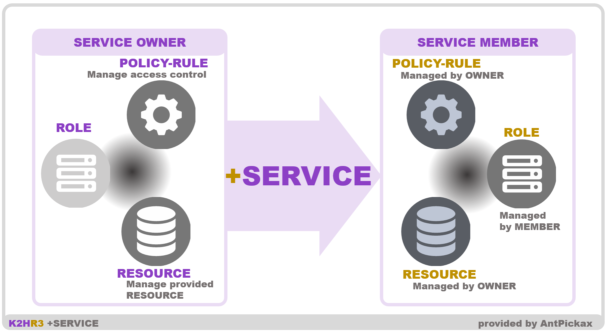
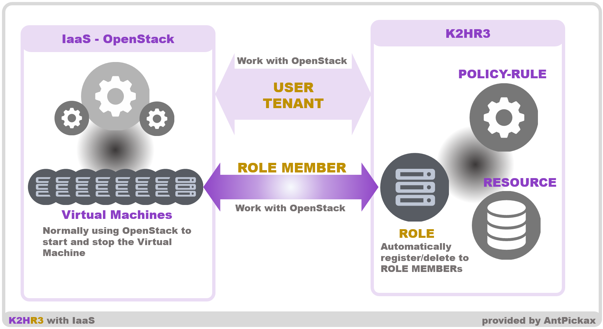

# 特徴
**K2HR3** (**K2H**dkc based **R**esource and **R**oles and policy **R**ules) は、Yahoo! JAPANオリジナルの **RBAC** (**R**ole **B**ased **A**ccess **C**ontrol) システムのひとつです。  
K2HR3のRBACシステムとしての特徴と、K2HR3が持ついくつかの独自の機能について説明します。

## RBAC
K2HR3は、RBACシステムとして、リソースへのアクセスを制御します。  
K2HR3は、誰が（**WHO**）何を（**WHAT**）どのように（**HOW**）アクセスするかを定義、制御するために使用します。  

### テナント（TENANT）
**テナント**（**TENANT**）とは、K2HR3を利用するユーザの属するグループです。  
K2HR3システムは、[OpenStack](https://www.openstack.org/)や[kubernetes](https://kubernetes.io/ja/)などのIaaSと連携できます。  
[OpenStack](https://www.openstack.org/)を使用する場合、K2HR3の**テナント**（TENANT）はOpenStackテナント（またはプロジェクト）と一致します。  
[kubernetes](https://kubernetes.io/ja/)の場合、kubernetesシステムで使用されているユーザー管理システムとリンクする必要があります。  

以下で説明するロール（ROLE）、リソース（RESOURCE）、ポリシー/ルール（POLICY）、サービス（SERVICE）のすべては、**テナント**（TENANT）に属するデータです。  
K2HR3のユーザは、いずれかの**テナント**（TENANT）に属する前提であり、属した**テナント**（TENANT）のデータを編集できます。

### ロール（ROLE）とは
K2HR3システムでの **ロール**（**ROLE**）とは、上述の **誰が**（WHO）を意味します。  
**ロール**（ROLE）は、**リソース**（RESOURCE）にアクセスする集合をグループ化したものです。  

**ロール**（ROLE）は、**リソース**（RESOURCE）にアクセスするアクセス元のグループであり、このグループに複数のホスト情報（IPアドレス他）を登録し、アクセスを許可します。  
**ロール**（ROLE）には、ホスト情報（IPアドレス他）のみではなく、他の複数の**ロール**（ROLE）を包含できます。  
これにより、役割に応じた**ロール**（ROLE）の定義を行い、複数の**ロール**（ROLE）を合成した別の**ロール**（ROLE）を定義することができます。  
以上の柔軟な**ロール**（ROLE）登録により、アクセスをする**リソース**（RESOURCE）に応じ、柔軟な**ロール**（ROLE）の定義を提供します。  

**ロール**（ROLE）へのメンバー（ホスト情報）登録/削除は、IaaS（[OpenStack](https://www.openstack.org/)、[kubernetes](https://kubernetes.io/ja/)）と連携し、自動的に行うことができます。  
これにより、K2HR3利用者は既存のIaaSで仮想HOST（Container）を登録する操作を行うだけで、自動的にK2HR3の**ロール**（ROLE）へのメンバー（ホスト情報）登録ができます。

### リソース（RESOURCE）とは
K2HR3システムでの **リソース**（**RESOURCE**）とは、上述の **何を**（WHAT）を意味します。  
**リソース**（RESOURCE）は、K2HR3利用者が登録する任意のデータ・情報です。  

**リソース**（RESOURCE）には、文字列、バイナリなど自由な形式のデータを登録できます。  
また、**リソース**（RESOURCE）を静的・動的なデータとして登録し、動的なデータとして登録した場合にはアクセスされた時点で可変なデータとして取り出すことができます。  

K2HR3で登録する**リソース**（RESOURCE）は、アクセスされるデータセットであり、登録した複数の**リソース**（RESOURCE）を組み合わせ、ひとつに合成し、取り出すこともできます。  
これにより、最小単位で**リソース**（RESOURCE）を定義し、複数の**リソース**（RESOURCE）をまとめたデータセットとしてアクセスすることが可能となり、あらゆるデータセットを作り出すことができます。  

動的な**リソース**（RESOURCE）は、K2HR3の提供する**テンプレートエンジン**を利用し、K2HR3に登録されているロール（**ROLE**）および**リソース**（RESOURCE）を組み合わせたデータセットとして登録することができます。

### ポリシー/ルール（**POLICY**）とは
K2HR3システムでの **ポリシー/ルール**（**POLICY**）とは、上述の **どのように**（HOW）を意味します。  
**ポリシー/ルール**（POLICY）は、**ロール**（ROLE）の**リソース**（RESOURCE）へのアクセス方法を定義しています。  

このアクセス方法である**ポリシー/ルール**（**POLICY**）には、以下の種類が準備されており、これらを組み合わせて定義します。  
- 読み出し許可（**READ**アクセス）
- 書き込み許可（**WRITE**アクセス）
- 実行許可（**EXECUTE**アクセス）__現時点で非提供のポリシーです__

**ポリシー/ルール**（**POLICY**）には、そのアクセス方法でアクセスする**リソース**（RESOURCE）を定義します。  
定義した**ポリシー/ルール**（**POLICY**）を**ロール**（ROLE）に登録することで、**ロール**（ROLE）から目的である**リソース**（RESOURCE）にアクセスを許可することができます。

### 概略図

## +SERVICE 機能
K2HR3は、RBACシステムとしての機能に加えて、**+サービス**（**+SERVICE**）機能を提供します。  
この **+サービス**（**+SERVICE**）機能は、RBACを前提として、利用者のシステム/サービスを運営における負荷軽減をする機能です。  

### 背景
ユーザに提供するシステム/サービスを複数のバックエンドを使って構築した場合、そのバックエンドへのアクセスの制御を管理するための運用コストが発生します。  
このようなシステム/サービスの場合、バックエンドを利用許可するための設定依頼、権限設定、動作確認などを、バックエンドの提供者、利用者間で調整しなくてはなりません。  
この調整は、システム追加や構成の変更の度に運用コストとして双方に発生します。  

この機能・情報を提供する所有者（OWNER）、利用者（MEMBER）間で調整する事項をRBACシステムとして提供できれば、運用コストを低減させることができます。  

K2HR3では、以下の条件を整えることにより運用コストを低減できると考えています。  
- バックエンドなどの機能・情報を提供する所有側（OWNER）は、利用側（MEMBER）のアクセス元の増減があった場合、利用側をグループ化して許可・不許可の設定をする。
- 所有側（OWNER）は、グループ別に提供する機能・情報を動的に設定できる。
- 利用側（MEMBER）は、許可されたグループ内でアクセス元の増減を自由に実行できる。

**+サービス**（**+SERVICE**）機能は、RBAC機能を、所有側（OWNER）、利用側（MEMBER）で連携させることで、上記の内容を可能とするために提供されます。  

### +SERVICE 連携
**+サービス**（**+SERVICE**）機能は、次に示すように機能・情報を提供する所有側（OWNER）と利用する側（MEMBER）で連携をします。  
**+サービス**（**+SERVICE**）機能を利用するためにサービス（SERVICE）を作成し、これを使って連携します。  

1. **[ 所有側（OWNER）]** サービス（SERVICE）を作成します
1. **[ 所有側（OWNER）]** リソース（RESOURCE）を設定します
1. **[ 所有側（OWNER）]** このサービスにアクセスする利用側の**テナント**（TENANT）を登録します
1. **[ 利用側（MEMBER） ]** このサービスを利用するグループであるロール（ROLE）を作成します
1. **[ 利用側（MEMBER） ]** サービス（SERVICE）の一覧に利用できるサービスが表示されおり、そのサービスの利用設定をします
1. **[ 利用側（MEMBER） ]** 前述のロール（ROLE)を連携するロールに指定します
1. **[ 利用側（MEMBER） ]** 自動的にサービスから提供されたリソース（RESOURCE）他が表示されます

サービス（SERVICE）の所有側（OWNER）は、利用側（MEMBER）の**テナント**（TENANT）を指定するだけです。  
利用側（MEMBER）は、サービス（SERVICE）を利用する**ロール**（ROLE）を自身の属する**テナント**（TENANT）以下に作成し、紐付けます。  
後は、所有側（OWNER）は利用側（MEMBER）に応じた**リソース**（RESOURCE）を設定するだけであり、利用側（MEMBER）も**ロール**（ROLE）の登録情報を自由に設定できます。  
**+サービス**（+SERVICE）機能により、所有側（OWNER）、利用側（MEMBER）の権限を分離し、管理できます。  

## IaaS（OpenStack、kubernetes）連携
K2HR3は、**IaaS**である [**OpenStack**](https://www.openstack.org/) および [**kubernetes**](https://kubernetes.io/ja/) と連携できます。  
[**OpenStack**](https://www.openstack.org/) および [**kubernetes**](https://kubernetes.io/ja/) と連携することにより、その仮想コンピューター（**Virtual Machine(VM)**）のインスタンスや、ポッド/コンテナー（**Pod** / **Container**）の起動（作成）/削除と連動し、起動/削除したインスタンスおよびコンテナーを**ロール**（ROLE）のメンバーに**自動で登録/削除**できます。  

**ロール**（ROLE）のメンバーに**自動で登録/削除**できることにより、既存のインスタンスの起動（作成）/削除の手順のままK2HR3システムを導入することができます。  

K2HR3の利用者は、インスタンスの起動（作成）前に、**ロール**（ROLE）を準備するだけです。  
インスタンスを起動（作成）すれば、事前準備した**ロール**（ROLE）に**自動登録**されます。  
インスタンスの削除をした場合にも、**ロール**（ROLE）から**自動的に削除**されます。  

