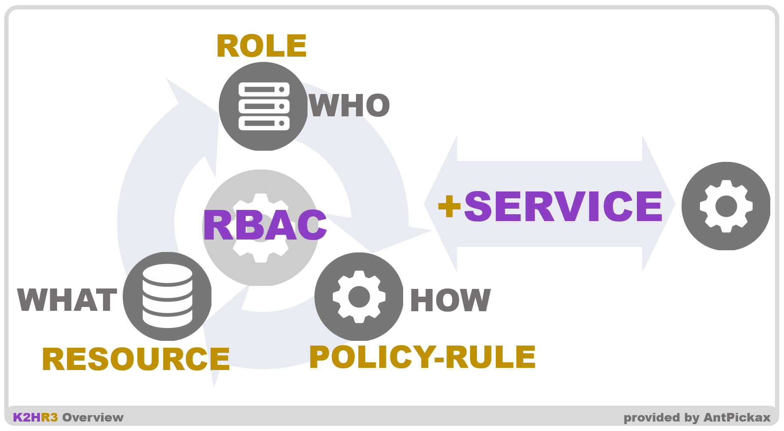

# K2HR3
**K2HR3**（**K2H**dkc based **R**esource and **R**oles and policy **R**ules）とは、リソースを操作するロール権限のアクセスポリシーを共通・共有化する **RBAC**（**R**ole **B**ased **A**ccess **C**ontrol）システムです。  

K2HR3はRBACとして、**誰（WHO＝ロール）**が、**何（WHAT＝リソース）**を、**どのように（HOW＝ポリシー/ルール）** アクセスするかを定義、制御するシステムです。  

K2HR3の利用者は、自由に定義したリソースへアクセスするグループを定義し、そのアクセスをポリシー/ルールにより制御することができます。  

任意のシステムに必要とされる情報・資産などをリソースとして定義することで、あらゆる状況においてアクセス制御を提供できる機会を与えることができます。  

## 背景
あらゆるシステムは、システム・サーバー・ホスト・プロセスを組み合わせ、サービスを提供しています。  

これらの最小構成であるプログラムは、自身の動作のための設定、情報等を必要とし、それらは環境に応じて変化するものです。  

特にクラウド環境に対応する場合、環境に応じた**情報（リソース）**を作成し、利用する必要があります。  

この情報（リソース）は、ホストの接続情報、プログラムの設定情報、認証関連情報などです。  

リソースは、それを取り扱う**グループ（ロール）**からアクセスされます。  

このリソースを管理し、制御するシステムとして、AWS（[Amazon Web Services](https://aws.amazon.com/)）のIAM（[AWS Identity and Access Management](https://docs.aws.amazon.com/IAM/latest/UserGuide/introduction.html)）などが先導しています。  

**IaaS**（[OpenStack](https://www.openstack.org/)、[kubernetes](https://kubernetes.io/ja/)）と**連携**し、AWS以外の環境で利用でき、**簡単に利用できるRBACシステム**を提供することを目的として、K2HR3は作成されました。  

そして、K2HR3を利用すれば、**トークン（TOKEN）などの認証・認可を不要**とし、ユーザのシステム開発・構築を簡単にしきます。  

## 目的
K2HR3は、IaaSなどのクラウド環境におけるシステム構築/サービス提供をするユーザに、その開発/構築のためのツール/システムを提供し、それらの開発効率向上を目的としています。  
K2HR3を利用することにより、開発者・サービス提供者がクラウド環境、非クラウド環境におけるのコストを低減できるようにしたいと思います。  

また、K2HR3をRBACとして利用するユーザのシステムにおいて、**認証・認可のための特別な処理を不要**とし、その開発・運用コストを低減できるようにしたいと思います。  

## 何をアクセス制御するのか

K2HR3は、  
**WHO**（誰が、どのグループが）  
**WHAT**（何を、どのような情報を）  
**HOW**（どうするか、どのようなアクセスをするか）  
を明確に定義し、**情報（リソース）へのアクセスを制御するRBACシステム**として機能します。  

## **+SERVICE** 機能
K2HR3は、RBACシステムとして、情報（リソース）、およびそれを管理・取り扱うグループ（ロール）を登録できます。  

一般的なWebサービスの内部では、リソースの管理者（ロール）が、そのリソースを他のグループ（ロール）に提供することがあります。  

これは、機能や情報（リソース）を提供する側（サービス提供側）と、それらを利用する側（サービス利用側）と区別することができます。  

一般的な例では、APIを提供するグループと、そのAPIを利用するグループがあり、これらが連携して、ユーザが利用するWebサービスができています。  

この機能や情報（リソース）を提供する側と、利用する側において、アクセス認可、グループ管理、グループメンバー管理等が必要になります。  

K2HR3の **+SERVICE** 機能を使うことで、機能や情報（リソース）の提供・利用の立場に応じた **権限の分離・管理** を簡単に構成できます。  

