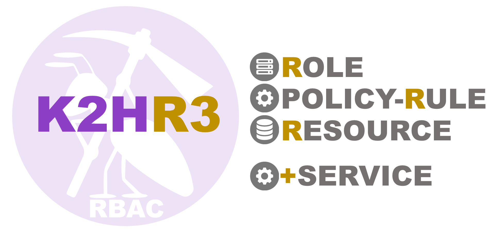

# **K2HR3**

**K2HR3** (**K2H**dkc based **R**esource and **R**oles and policy **R**ules) is one of extended **RBAC** (**R**ole **B**ased **A**ccess **C**ontrol) system.  
**K2HR3** works as **RBAC** in conjunction with **IaaS**(Infrastructure as a Service) and provides convenient functions for using **RBAC** To do.  
Currently available **IaaS**(Infrastructure as a Service) is [**OpenStack**](https://www.openstack.org/) and [**kubernetes**](https://kubernetes.io/ja/).  

**K2HR3** gathers common management information for the cloud, and is built **K2HASH**, **K2HASH TRANSACTION PLUGIN**, **CHMPX** and **K2HDKC** components.  
**K2HR3** is one of [AntPickax](https://antpick.ax/)'s open source product by Yahoo! JAPAN.

## {{ page.arrow_link_overview }}
[Overview](home.html) about **K2HR3** system.

## {{ page.arrow_link_feature }}
The explanation of the detailed [Feature](feature.html) of **K2HR3** system.

## {{ page.arrow_link_whatnew }}
[What's new](whatnew.html) about **K2HR3** system.

## {{ page.arrow_link_detail }}
[Detail](detail.html) of **K2HR3** system.

## {{ page.arrow_link_usage }}
How to [use](usage.html) **K2HR3** system for your systems.  
You can experience the operation of **K2HR3 Web Application** with [K2HR3 demonstration](https://demo.k2hr3.antpick.ax/).

## {{ page.arrow_link_setup }}
How to [setup](setup.html) **K2HR3** system.

## {{ page.arrow_link_developer }}
Detailed description of the programming interface provided by **K2HR3** system for [developer](developer.html)s.
And explained how to build JavaScript loaded in the browser to use **K2HR3** system.  
All source code related to the **K2HR3** system is published on **GitHub**.  
- [K2HR3](https://github.com/yahoojapan/k2hr3)
- [K2HR3 Web Application](https://github.com/yahoojapan/k2hr3_app)
- [K2HR3 Command Line Interface](https://github.com/yahoojapan/k2hr3_cli)
- [K2HR3 REST API](https://github.com/yahoojapan/k2hr3_api)
- [K2HR3 OpenStack Notification Listener](https://github.com/yahoojapan/k2hr3_osnl)
- [K2HR3 Container Registration Sidecar](https://github.com/yahoojapan/k2hr3_sidecar)
- [K2HR3 Utilities](https://github.com/yahoojapan/k2hr3_utils)
- [K2HR3 Get Resource](https://github.com/yahoojapan/k2hr3_get_resource)

## {{ page.arrow_link_environments }}
Description of [Environment and Settings](environments.html) variables used by **K2HR3** system to load.

## {{ page.arrow_link_tools }}
A list of [Tools](tools.html) provided by **K2HR3**.

# **About AntPickax**
[AntPickax](https://antpick.ax/) is product group that is provided as open source by Yahoo! JAPAN.  
Please see the [AntPickax](https://antpick.ax/) details page.
