# RANCHER Helm Chart
The **K2HR3 Helm Chart** is a **Helm Chart** for building a K2HR3 system using [Helm(The package manager for Kubernetes)](https://helm.sh/) in a [kubernetes](https://kubernetes.io/) environment.  
This **K2HR3 Helm Chart** can be used as **RANCHER Helm Chart** from [RANCHER](https://rancher.com/).  

## Overview
You can register **K2HR3 Helm Chart** as **RANCHER Helm Chart** into the repository in the [RANCHER](https://rancher.com/).  
Then you can easily build up your K2HR3 system from the chart registered in the [RANCHER](https://rancher.com/) repository.  

**K2HR3 Helm Chart** is published as a Chart repository at [K2HR3 Helm Chart repository](https://helm.k2hr3.antpick.ax/) and [Artifact Hub](https://artifacthub.io/packages/helm/k2hr3/k2hr3).  

Using the [RANCHER](https://rancher.com/) UI, you can register the **K2HR3 Helm Chart** published in [Artifact Hub](https://artifacthub.io/packages/helm/k2hr3/k2hr3) as a repository.  
The source code for the K2HR3 Helm Chart is available on [k2hr3_helm_chart - Github](https://github.com/yahoojapan/k2hr3_helm_chart).  

### Using Helm command
The **K2HR3 Helm Chart** can be used as a regular **Helm Chart**.  
If you want to use `helm` command for **K2HR3 Helm Chart**, please refer to [here](helm_chart.html).  

# Use with RANCHER
The procedure for using **K2HR3 Helm Chart** [RANCHER](https://rancher.com/) which is **multi-cluster orchestration platform for kubernetes** is explained below.  

The following explanation assumes that the [RANCHER](https://rancher.com/) environment has been set up.  
Please refer to [RANCHER](https://rancher.com/) for the setup.  

## Cluster in RANCHER
Determine the **cluster** of RANCHER on which to deploy the K2HR3 system by **K2HR3 Helm Chart**.  
You create a cluster as needed.  

The following figure logs in to the **RANCHER UI** and displays a list of clusters.  

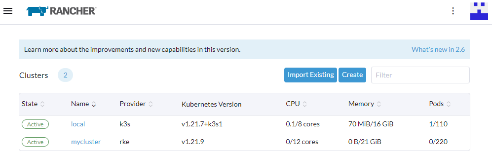  

The following steps will be described using **mycluster**.

## Add repository
Select the RANCHER cluster(`mycluster`) to display the cluster setting page.  
Select `Apps & Marketplace` > ` Repositories` in the left pane to display the content shown below.  

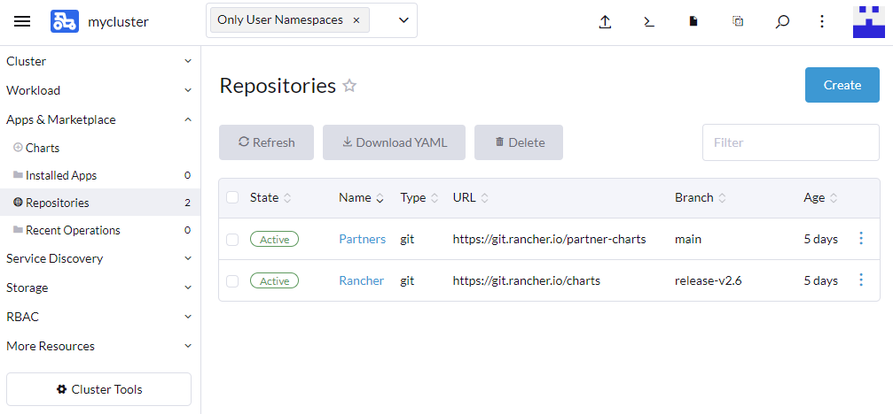  

Click the **Create** button on this page to register the **K2HR3 Helm Chart** as a repository.  

Click the **Create** button to display the **Repository: Create** page shown below.  

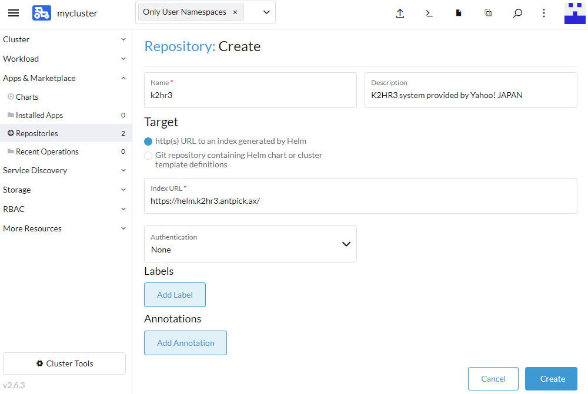  

In order to register **K2HR3 Helm Chart** as a repository, set the values in the following items(required).  
- Name  
Please input `k2hr3`.
- Target  
Select `http(s) URL to an index generated by Helm`.
- index URL  
Enter `https://helm.k2hr3.antpick.ax/`.

After setting the above values, click the **Create** button in this page.  

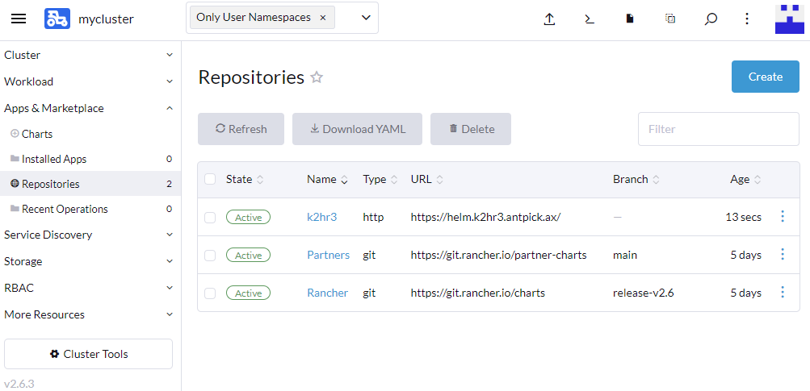  

Now, as shown above **K2HR3 Helm Chart** has been registered as a RANCHER repository.  

## Chart installation
Then install **K2HR3 Helm Chart**.  

Select `Apps & Marketplace` > `Charts` in the left pane to see a list of available `Charts`.  

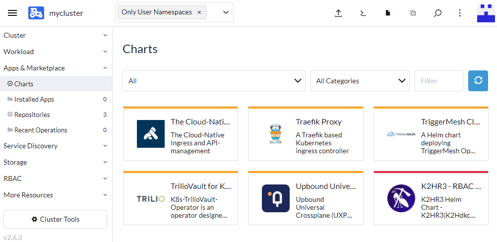  

You can find the `K2HR3` in this Chart list.  

Clicking on the `K2HR3` in the list will take you to a page where you can install the **K2HR3 Helm Chart**.  

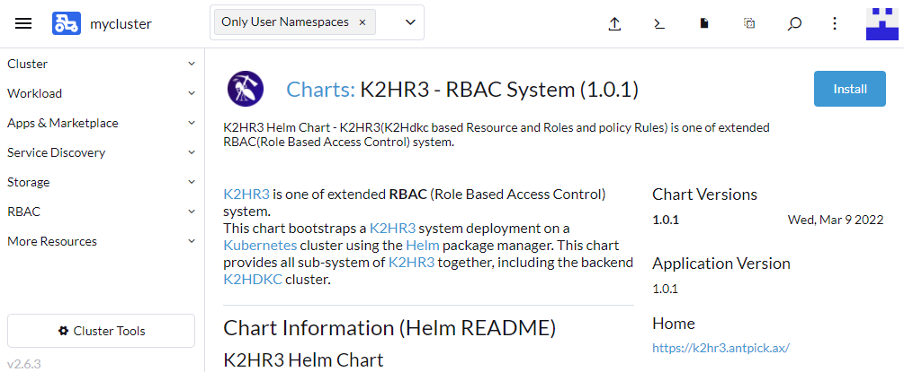  

Click the **Install** button in the upper right to next step.  

### Chart Install : Step 1
The `Install: Step 1` page is displayed as shown below.  

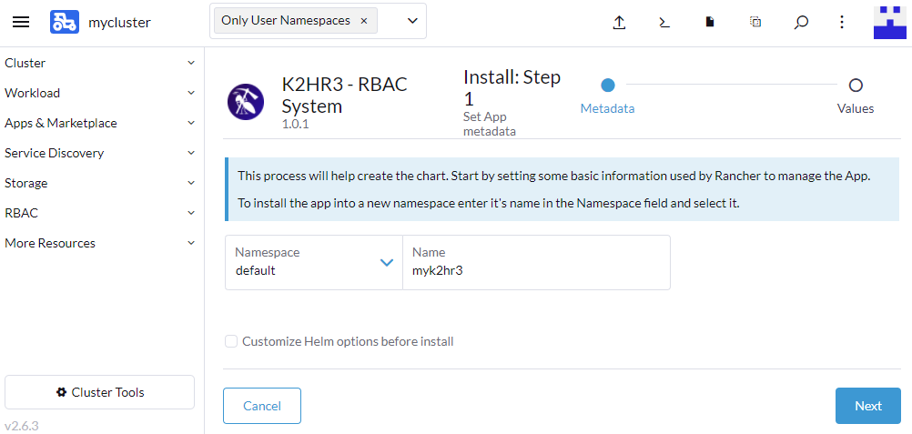  

In this step 1, enter the `Name` of the K2HR3 system you want to install.  
In the above example, `myk2hr3` is entered for` Name`.  

After entering `Name`, click the **Next** button.  

### Chart Install : Step 2
The `Install: Step 2` page is displayed as shown below.  

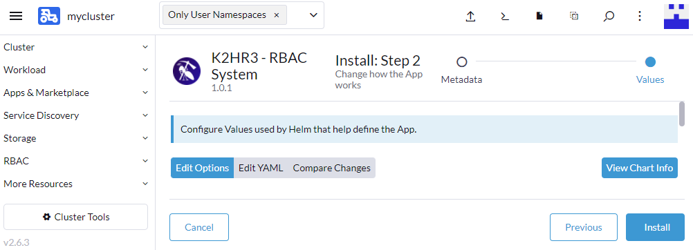  

In this step, set the following items:  
- K2HR3 System Authentication
- K2HR3 Web Application(subsystem)
- K2HR3 REST API(subsystem)
- Backend K2HDKC Cluster(backend system)

Each setting items is explained below.

#### K2HR3 Authentication
On the `Install: Step 2` page, select `Edit Option` and then `K2HR3 Authentication` from the list.  

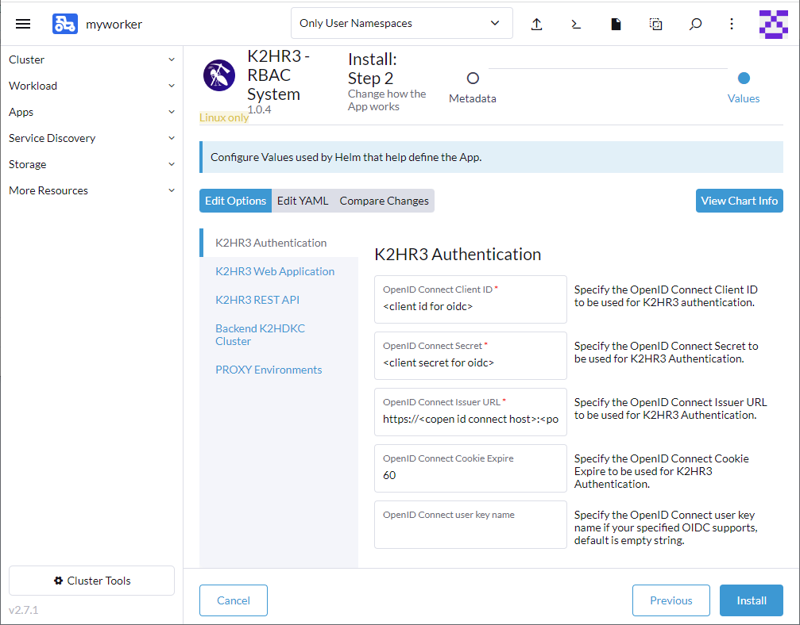  

The `K2HR3 System Authentication` supported by the **K2HR3 Helm Chart** is only [OpenID Connect](https://openid.net/connect/).  

In this `K2HR3 Authentication` setting, enter the [OpenID Connect](https://openid.net/connect/) information used by the K2HR3 System.  

The following items are required to be set:  
- OpenID Connect Client ID
- OpenID Connect Secret
- OpenID Connect Issuer URL

After entering the required items, the setting of this `K2HR3 Authentication` item is completed.  

#### K2HR3 Web Application
On the `Install: Step 2` page, select `Edit Option` and then `K2HR3 Web Application` from the list.  

  

In this setting, enter the information for `K2HR3 Web Application` which is one of the K2HR3 subsystem.  
The following items are required to be set:  
- External hostanme or IP address

Enter the `Hostname(FQDN)` or `IP address` to access the `K2HR3 Web Application`.  
The `K2HR3 Web Application` is configured as a `NodePort` kubernetes service.  
Therefore, set this value to one of the `Worker nodes` that make up the RANCHER cluster(`mycluster`) that builds the K2HR3 system.  
Alternatively, set the `Hostname` that can reach this `NodePort` service according to the environment.  

After entering the required items, the setting of this `K2HR3 Web Application` item is completed.  

#### K2HR3 REST API
On the `Install: Step 2` page, select `Edit Option` and then `K2HR3 REST API` from the list.  

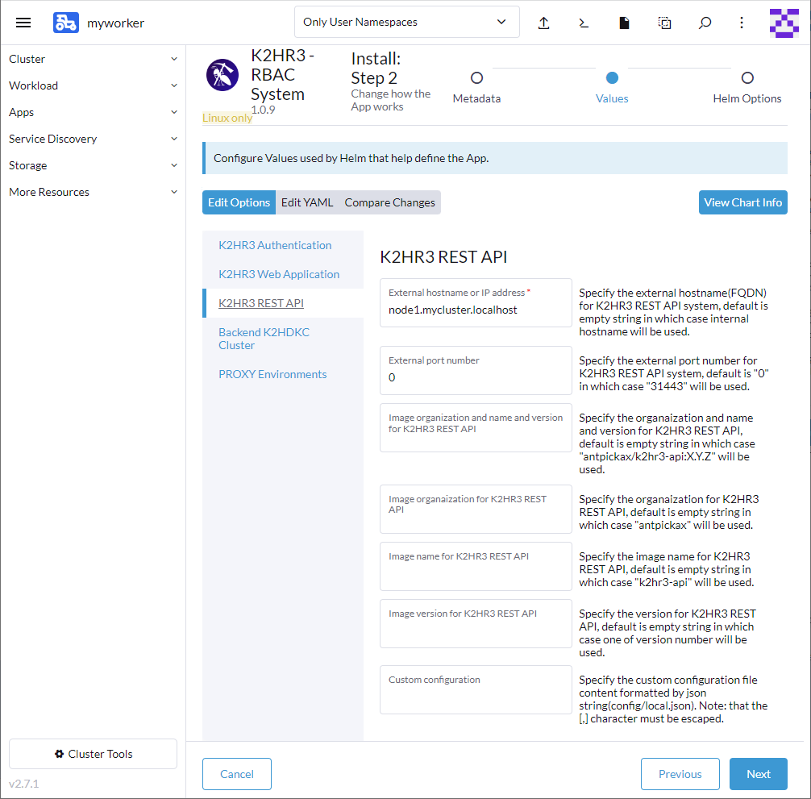  

In this setting, enter the information for `K2HR3 REST API` which is one of the K2HR3 subsystem.  
The following items are required to be set:  
- External hostanme or IP address

Enter the `Hostname(FQDN)` or `IP address` to access the `K2HR3 REST API`.  
The `K2HR3 REST API` is configured as a `NodePort` kubernetes service.  
Therefore, set this value to one of the `Worker nodes` that make up the RANCHER cluster(`mycluster`) that builds the K2HR3 system.  
Alternatively, set the `Hostname` that can reach this `NodePort` service according to the environment.  

After entering the required items, the setting of this `K2HR3 REST API` item is completed.  

#### Backend K2HDKC Cluster
On the `Install: Step 2` page, select `Edit Option` and then `Backend K2HDKC Cluster` from the list.  

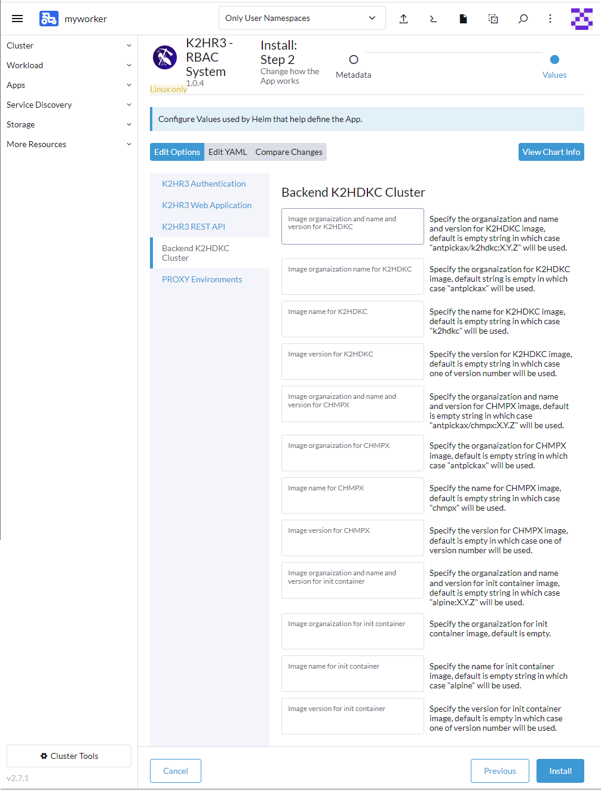  

In this setting, enter the information for `K2HDKC Cluster` which is back-end system of the K2HR3 subsystem.  
There are no required fields in this setting.  
This setting allows you to specify the `K2HDKC` and` CHMPX` images used by the K2HR3 system.  
Normally, you can leave these values unset and use the default values.  

After entering the required items, the setting of this `Backend K2HDKC Cluster` item is completed.  


After completing the above `Install: Step 2` settings, click the **Install** button at the bottom right.  

## Chart installed
The installation of **K2HR3 Helm Chart** will start, and when it is completed, the following screen(`Apps & Marketplace` > `Installed Apps`) will be displayed.

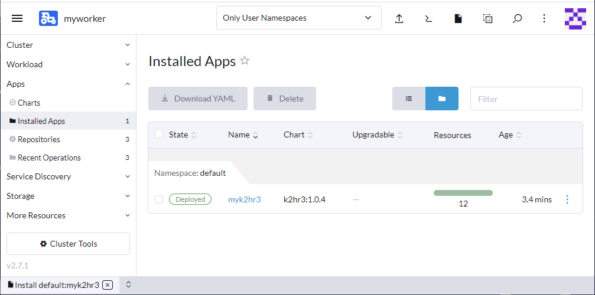  

If you see the `Deployed` badge, you have successfully installed your K2HR3 system.  

### Deployments
Displays the `Deployments` installed by the **K2HR3 Helm Chart**.  
In the left pane, select `Workload` > `Deployments` to confirm.  

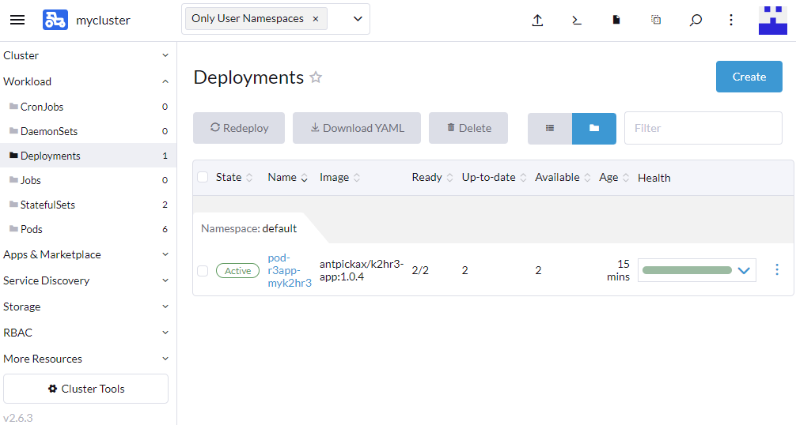  

If you see `pod-r3app-myk2hr3`(case of `Name=myk2hr3`) and the `Active` badge, then `Deployments` is successful.  

### StatefulSets
Displays the `StatefulSets` installed by the **K2HR3 Helm Chart**.  
In the left pane, select `Workload` > `StatefulSets` to confirm.  

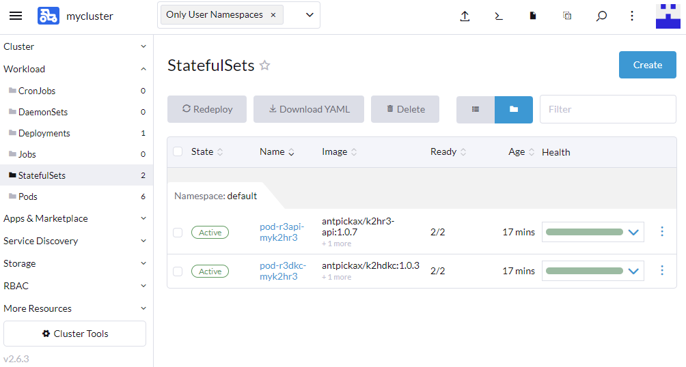  

If you see `pod-r3api-myk2hr3` and `pod-r3dkc-myk2hr3`(case of `Name=myk2hr3`) and the `Active` badge on the both of them, then `StatefulSets` is successful.  

### Pods
Displays the `Pods` installed by the **K2HR3 Helm Chart**.  
In the left pane, select `Workload` > `Pods` to confirm.  

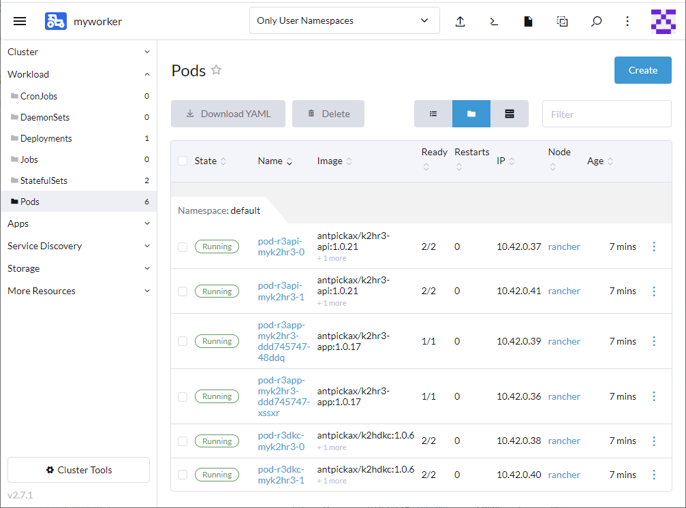  

If you see A total of 6 pods, `pod-r3api-myk2hr3-[0,1]`, `pod-r3app-myk2hr3-[xxx,yyy]` and `pod-r3dkc-myk2hr3-[0,1]`(case of `Name=myk2hr3`) and the `Running` badge on the both of them, then `Pods` is successful.  

## Check K2HR3 System
Check the operation of the installed K2HR3 system.  

Use the `External hostanme or IP address` and `External port number` set in the `K2HR3 Web Application` and the `K2HR3 REST API`.  

### K2HR3 REST API
First, check access to the `K2HR3 REST API`.  
The `K2HR3 REST API` is a REST API server accessed from the `K2HR3 Web Application`, so you need to check it first.

Use the `Hostname` set in `External hostanme or IP address`.  
You also need to know the `port number` set in `External port number`.  
`External port number` is not a required setting item, so if it is not set, it will be` 31443`.  

From your browser, access to following URL:  
```
https://<Hostname>:<Port number>/
```
Using the example explained so far, the URL will be as follows:  
```
https://node1.mycluster.localhost:31443
```

If you can successfully access to `K2HR3 REST API`, you will see the following text:  
```
{"version":["v1"]}
```

#### Notes
The K2HR3 system installed by **K2HR3 Helm Chart** uses a `self-signed certificate`(TLS).  
Therefore, when you try to view it in a browser, you get an error such as `Your connection is not private`.  
Please allow access from `Hide advanced` button.  
(The above is the wording displayed on Google Chrome, so please operate according to your browser.)

### K2HR3 Web Application
Next, check access to the `K2HR3 Web Application`.  

Use the `Hostname` set in `External hostanme or IP address`.  
You also need to know the `port number` set in `External port number`.  
`External port number` is not a required setting item, so if it is not set, it will be` 32443`.  

From your browser, access to following URL:  
```
https://<Hostname>:<Port number>/
```
Using the example explained so far, the URL will be as follows:  
```
https://node1.mycluster.localhost:32443/
```

If you can successfully access to `K2HR3 Web Application`, you will see the following page.  

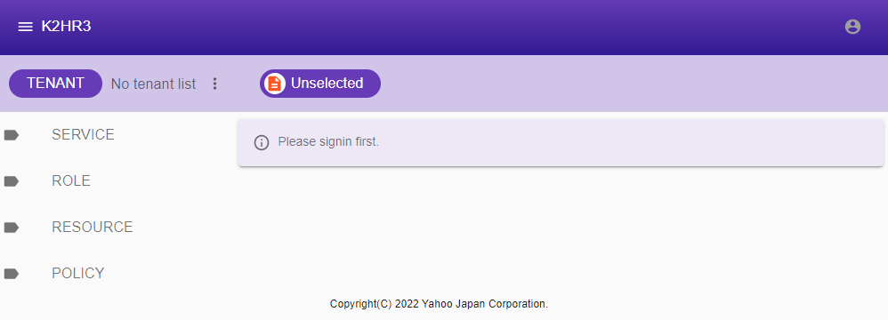  

Then click the button in the upper right corner and select `Sign in` to sign in.  

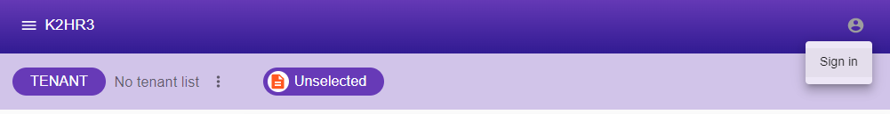  

If you can sign in normally, the icon indicating the sign-in status on the upper right will be displayed in white as shown in the screen below.  

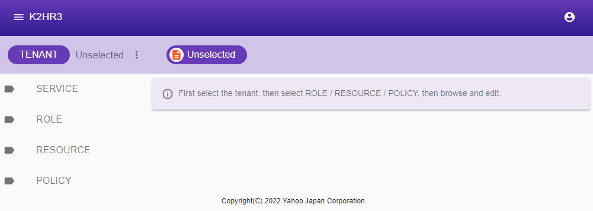  

You have now confirmed that the `K2HR3 Web Application` and K2HR3 systems are working properly.  

#### Notes
The K2HR3 system installed by **K2HR3 Helm Chart** uses a `self-signed certificate`(TLS).  
Therefore, when you try to view it in a browser, you get an error such as `Your connection is not private`.  
Please allow access from `Hide advanced` button.  
(The above is the wording displayed on Google Chrome, so please operate according to your browser.)

## Let's up K2HR3 system
Now you knew how to install a K2HR3 system using [RANCHER](https://rancher.com/) and **K2HR3 Helm Chart**.  

In the above example, we installed the K2HR3 system by setting only the required items, but we can customize it further.  
If you want to customize something other than what is shown in `Install: Step 2`, you can select `Edit YAML` and edit the value of `values.yaml` in **K2HR3 Helm Chart** directly.  

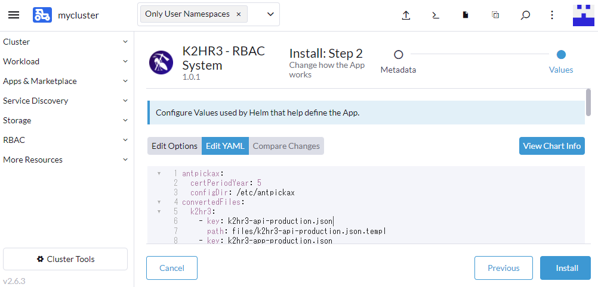  

The values ​​you can change are the same as when customizing the **K2HR3 Helm Chart** using from the `helm` command.  
For the definition and default value of each variable, refer to [K2HR3 Helm Chart Option](helm_chart.html).  

As described above, if you use **K2HR3 Helm Chart** as **RANCHER Helm Chart** in [RANCHER](https://rancher.com/), you can easily install a K2HR3 system.  
