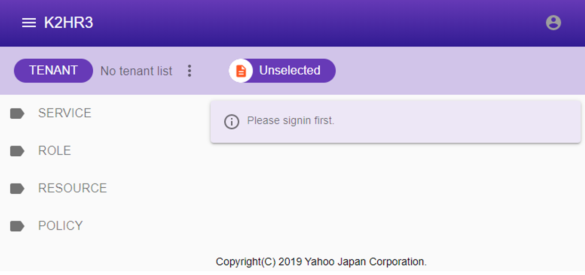

# Usage
This section describes how to use K2HR3 system.

# Basic Usage
[Basic Usage](usage_base.html) page provides the K2HR3 basic terms and essential procedures to use K2HR3 system as a **RBAC**(**R**ole **B**ased **A**ccess **C**ontrol) system.  
After reading the page, you will find out how to access to **RESOURCE** by using K2HR3 system.

## K2HR3 Template Engine
**USER** can provide **dynamic RESOURCE** for each user and define/register it as **TEMPLATE** in K2HR3 system.  
The **K2HR3 Template Engine** is used to create **dynamic RESOURCE** from the **TEMPLATE**.  
**Dynamic RESOURCE** make **USER** more efficient.  
The description and usage of **TEMPLATE** defining **dynamic RESOURCE** is described in [**K2HR3 template engine**](usage_template.html).

# +SERVICE Usage
K2HR3 system provides the **+SERVICE** feature that provides **USER** to cooperate with each other very easily.
To use the **+SERVICE** feature, **USER**  firstly defines a **SERVICE** in a K2HR3 system.

See the [+SERVICE Usage](usage_service.html) page for details after reading the [Basic Usage](usage_base.html) page.

# Web Application Usage
In order to operate **ROLE**, **POLICY-RULE**, **RESOURCE** and **SERVICE**, **USER** can use **K2HR3 Web Application** as the control panel provided by the K2HR3 system.  
[K2HR3 Web Application](usage_app.html) describes how to operate these data using the browser.  

## Demonstration site
You can experience the **K2HR3 Web Application** on [K2HR3 Demonstration](https://demo.k2hr3.antpick.ax/).  
You can learn the operation of **ROLE**, **POLICY-RULE**, **RESOURCE** and **SERVICE** provided by the K2HR3 system.  

# REST API Usage
The [REST API Usage](api.html) page provides information about **K2HR3 REST API** that every **USER** can define and use **ROLE**, **POLICY-RULE**, **RESOURCE** and **SERVICE**.  
See the [REST API Usage](api.html) page for details.

# Command Line Interface(CLI) Usage
The [Command Line Interface Usage](cli.html) page provides information about **K2HR3 Command Line Interface(CLI)** that every **USER** can define and use **ROLE**, **POLICY-RULE**, **RESOURCE** and **SERVICE**.  
See the [Command Line Interface Usage](clii.html) page for details.

# How to access RESOURCE as RBAC
K2HR3 provides **RBAC**(**R**ole **B**ased **A**ccess **C**ontrol) system that controls access from **ROLE** to **RESOURCE** with **POLICY-RULE**.  
**USER** defines **RESOURCE**, defines the access method as **POLICY-RULE**, and registers the access source **HOST** to be permitted as a **ROLE member**.  

The usage of the **RBAC** system provided by this K2HR3 system is explained in [RBAC Usage](usage_rbac.html) page.

# Other Usage
See the [other usage](usage_other.html) page for the other use cases.

