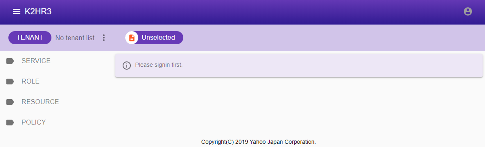
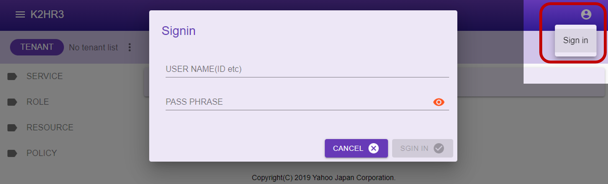
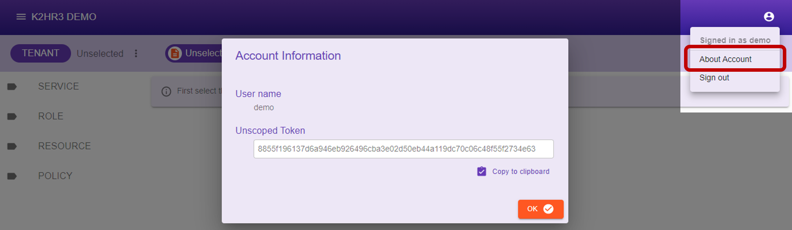

# Common Usage for K2HR3 Web Application
This section explains the common usage of the **K2HR3 Web Application**.

### How to access
By accessing the URI set up as the **K2HR3 Web Server**, the **K2HR3 Web Application** will be loaded in the browser and you can use it.
```
http(s)://<k2hr3 web server FQDN[:port]>/
```

## Displaying K2HR3 Web Application
When loading the **K2HR3 Web Application** on your browser, the following screen will be displayed.  



_In the above screen, USER has not signed in yet._  

## Sign in
To sign in to the **K2HR3 Web Application**, click  button in the upper right.  
As the menu is displayed, select **Sign in** menu item.  

If user authentication for the K2HR3 system is set to credential, the dialog shown below is displayed.  
If it is set to use other user authentication, it will behave according to that setting.  

Please enter your **user name** and **passphrase** in the displayed dialog and sign in.  



## User Account Information
After signing in to the **K2HR3 Web Application**, you can view your account information.  
You can view the your account information as shown below.  



This dialog displays the `Username` and the your `Unscoped Token`.

### About USER
The K2HR3 system can operate in conjunction with **OpenStack** or **other any user authentication systems**.  
A K2HR3 **USER** is an OpenStack user or other any user authentication system user.  
To sign in, use a passphrase with a user from OpenStack or other any user authentication system with which the K2HR3 system is cooperated.

## Sign out
To sign out from the **K2HR3 Web Application**, click  button in the upper right.  
A menu will be displayed, so select **Sign out** menu item.

