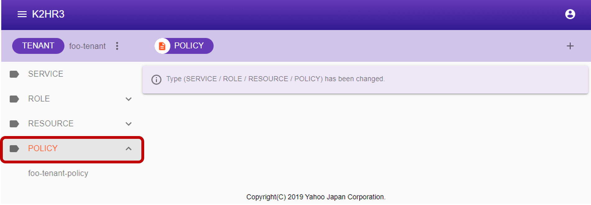
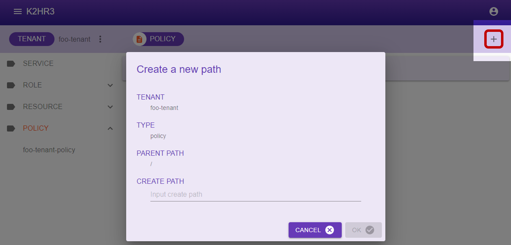
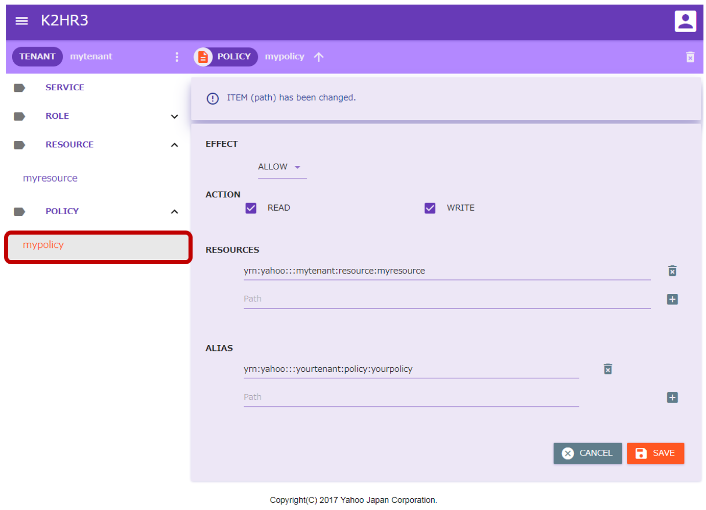
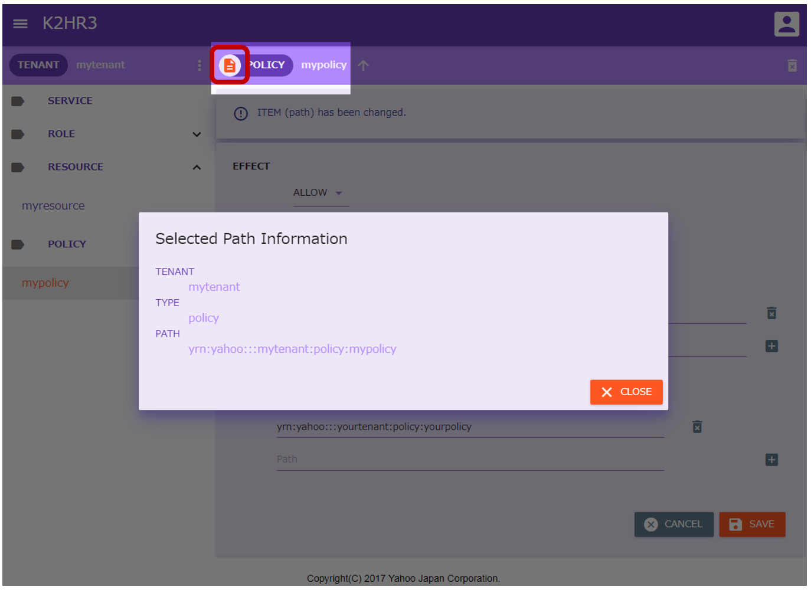

# ポリシー/ルール（POLICY）
K2HR3 Webアプリケーションでのポリシー/ルール（POLICY）操作の説明をします。

## ポリシー/ルール（POLICY）の表示
テナント（TENANT）にまだポリシー/ルール（POLICY）が登録されていない場合（初めてK2HR3システムを利用する場合など）、まずポリシー/ルール（POLICY）の登録が必要となります。  
すでにポリシー/ルール（POLICY）が存在する場合、左側ツリー表示の中の**POLICY**を選択することで、登録済みのポリシー/ルール（POLICY）を見ることができます。  

## ポリシー/ルール（POLICY）の登録
ポリシー/ルール（POLICY）を登録するには、左側ツリー中の**POLICY**を選択した後、上部の**[POLICY]**横の   ボタンをクリックします。  
ポリシー/ルール（POLICY）登録用のダイアログが表示されます。  

表示されたダイアログにポリシー/ルール（POLICY）名を入力し、 ボタンをクリックすれば、ポリシー/ルール（POLICY）が登録されます。  
ダイアログに表示される項目とその内容を以下に示します。  
- TENANT  
ポリシー/ルール（POLICY）を登録するテナント（TENANT）名が表示されます。
- TYPE  
ポリシー/ルール（POLICY）であることを示す**policy**が表示されます。
- PARENT PATH  
ポリシー/ルール（POLICY）の場合、常に**/**が表示されます。  
_ポリシー/ルール（POLICY）は階層化できないので、常にこの値になります。_
- CREATE PATH  
登録するポリシー/ルール（POLICY）名を入力します。

登録されたポリシー/ルール（POLICY）は、左側ツリーの**POLICY**を展開することで確認できます。  

## ポリシー/ルール（POLICY）の編集
登録されているポリシー/ルール（POLICY）の内容を編集するには、まず編集するポリシー/ルール（POLICY）を左側ツリーで選択します。  
選択後、メインの画面エリアにそのポリシー/ルール（POLICY）の情報が表示されます。  
この表示されている内容を編集、およびデータの追加をします。  
編集後は、   ボタンをクリックし、その内容を保存します。  
編集を破棄する場合は、   ボタンをクリックしてください。  

ポリシー/ルール（POLICY）選択後のメインの画面エリアに表示される項目について説明します。
- EFFECT  
アクセス方法（ACTION）に対する効果（EFFECT）が表示されます。  
許可（ALLOW）もしくは拒否（DENY）が選択されています。
- ACTION  
アクセス方法（ACTION）が表示されています。  
読み出し（READ）と書き込み（WRITE）のいずれか、もしくは両方が選択されています。
- RESOURCES  
登録されているリソース（RESOURCE）の**[YRN](detail_variousja.html)フルパス**が列挙されます。  
編集・追加する場合にも、**[YRN](detail_variousja.html)フルパス**で入力します。
- ALIAS  
登録されているエリアス（ALIAS）が表示されます。  
エリアス（ALIAS）は他ポリシー/ルール（POLICY）への**[YRN](detail_variousja.html)フルパス**で表示されます。  
編集・追加する場合にも、**[YRN](detail_variousja.html)フルパス**で入力します。

## ポリシー/ルール（POLICY）の属性情報
登録されているポリシー/ルール（POLICY）の属性情報を表示するには、まずポリシー/ルール（POLICY）を左側ツリーで選択します。  
選択後、上部の**[POLICY]**左横の   をクリックし、ポリシー/ルール（POLICY）の属性情報（Selected Path Information）ダイアログを表示します。  
このダイアログに、ポリシー/ルール（POLICY）の属性情報が表示されます。  

ポリシー/ルール（POLICY）の属性情報について説明します。
- TENANT  
ポリシー/ルール（POLICY）が属しているテナント（TENANT）名を表示します。
- TYPE  
"policy"と表示します。
- PATH  
このポリシー/ルール（POLICY）への**[YRN](detail_variousja.html)フルパス**を表示します。  
この**[YRN](detail_variousja.html)フルパス**は、ロール（ROLE）、ポリシー/ルール（POLICY）のエリアス（ALIAS）等の設定を行うときに使います。

