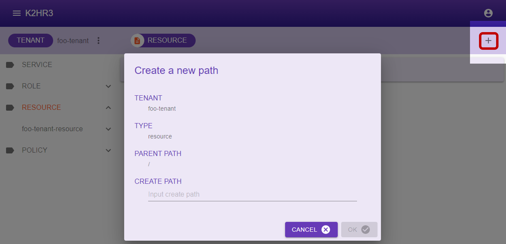
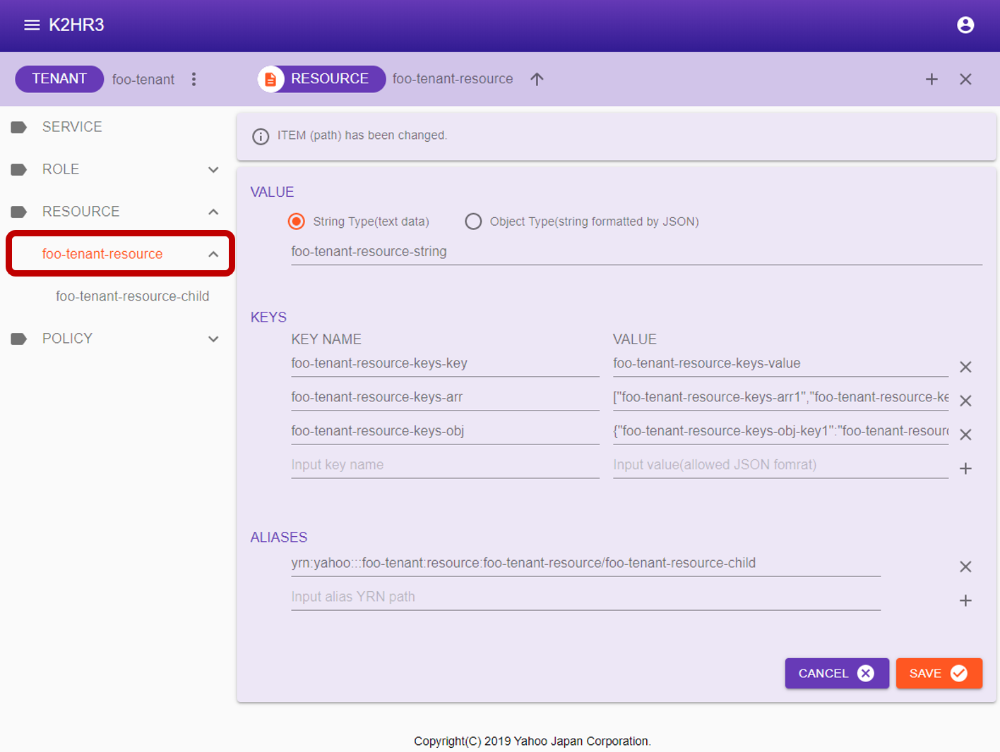
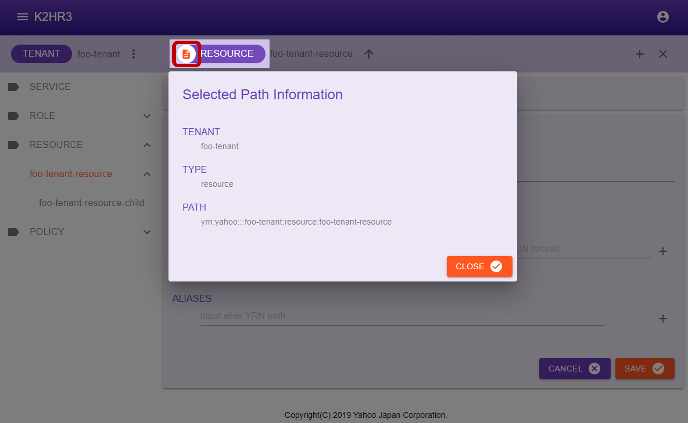

# リソース（RESOURCE）
K2HR3 Webアプリケーションでのリソース（RESOURCE）操作の説明をします。

## リソース（RESOURCE）の表示
テナント（TENANT）にまだリソース（RESOURCE）が登録されていない場合（初めてK2HR3システムを利用する場合など）、まずリソース（RESOURCE）の登録が必要となります。  
すでにリソース（RESOURCE）が存在する場合、左側ツリー表示の中の**RESOURCE**を選択することで、登録済みのリソース（RESOURCE）を見ることができます。  

## リソース（RESOURCE）の登録
リソース（RESOURCE）を登録するには、左側ツリー中の**RESOURCE**を選択した後、上部の**[RESOURCE]**横の  ボタンをクリックします。  
_階層化したリソース（RESOURCE）を登録する場合には、左側ツリーから親とする既存リソース（RESOURCE）を選択後、ボタンをクリックしてください。_  
リソース（RESOURCE）登録用のダイアログが表示されます。  

表示されたダイアログにリソース（RESOURCE）名を入力し、 ボタンをクリックすれば、リソース（RESOURCE）が登録されます。  
ダイアログに表示される項目とその内容を以下に示します。  
- TENANT  
リソース（RESOURCE）を登録するテナント（TENANT）名が表示されます。
- TYPE  
リソース（RESOURCE）であることを示す**resource**が表示されます。
- PARENT PATH  
登録するリソース（RESOURCE）の親の**[YRN](detail_variousja.html)パス**が表示されます。  
階層化していないトップレベル（親を持たない）のリソース（RESOURCE）の場合、**/**と表示されます。  
親リソース（RESOURCE）の下に登録する場合には、その親リソース（RESOURCE）の**[YRN](detail_variousja.html)パス**が表示されます。  
たとえば、リソース（RESOURCE）名 **toplevel** の下にリソース（RESOURCE）を登録する場合、**/toplevel** と表示されます。
- CREATE PATH  
登録するリソース（RESOURCE）名を入力します。

登録されたリソース（RESOURCE）は、左側ツリーの**RESOURCE**を展開することで確認できます。  

## リソース（RESOURCE）の編集
登録されているリソース（RESOURCE）の内容を編集するには、まず編集するリソース（RESOURCE）を左側ツリーで選択します。  
選択後、メインの画面エリアにそのリソース（RESOURCE）の情報が表示されます。  
この表示されている内容を編集、およびデータの追加をします。  
編集後は、   ボタンをクリックし、その内容を保存します。  
編集を破棄する場合は、   ボタンをクリックしてください。  

リソース（RESOURCE）選択後のメインの画面エリアに表示される項目について説明します。
- VALUE  
リソース（RESOURCE）の値（データ）が表示されます。  
  - 値（データ）の種別  
    値（データ）の種別（取り扱い方）を示します。  
    文字列（Text String Type）もしくは、JSON文字列（Object(JSON) Type）が選択されています。
  - 値（データ）  
    値（データ）が表示されています。編集する場合は、値（データ）を入力してください。
- KEYS  
登録されているキーと値のペアが表示されます。  
複数のペアの登録が可能です。  
編集する場合は、直接変更をすることができます。  
追加、削除もできます。
- ALIAS  
登録されているエリアス（ALIAS）が表示されます。  
エリアス（ALIAS）は他リソース（RESOURCE）への**[YRN](detail_variousja.html)フルパス**で表示されます。  
編集・追加する場合にも、**[YRN](detail_variousja.html)フルパス**で入力します。

## リソース（RESOURCE）の属性情報
登録されているリソース（RESOURCE）の属性情報を表示するには、まずリソース（RESOURCE）を左側ツリーで選択します。  
選択後、上部の**[RESOURCE]**左横の  をクリックし、リソース（RESOURCE）の属性情報（Selected Path Information）ダイアログを表示します。  
このダイアログに、リソース（RESOURCE）の属性情報が表示されます。  

リソース（RESOURCE）の属性情報について説明します。
- TENANT  
リソース（RESOURCE）が属しているテナント（TENANT）名を表示します。
- TYPE  
"resource"と表示します。
- PATH  
このリソース（RESOURCE）への**[YRN](detail_variousja.html)フルパス**を表示します。  
この**[YRN](detail_variousja.html)フルパス**は、ポリシー/ルール（POLICY）、リソース（RESOURCE）のエリアス（ALIAS）等の設定を行うときに使います。

