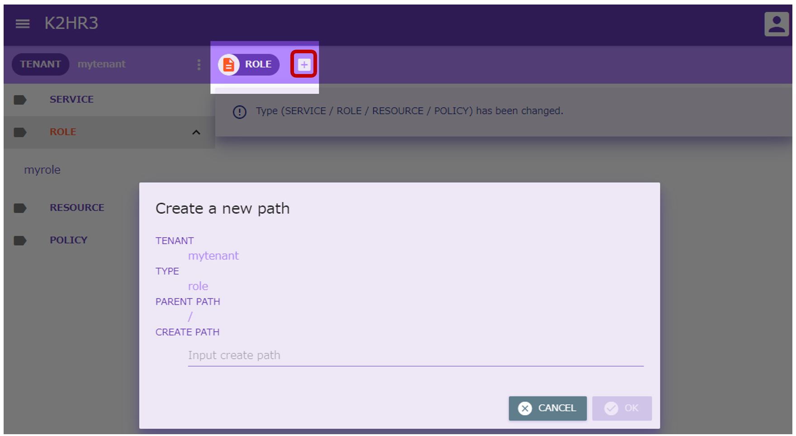
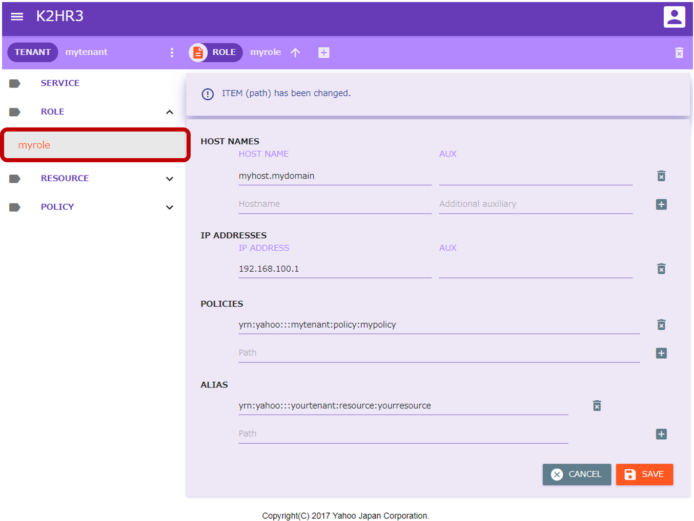
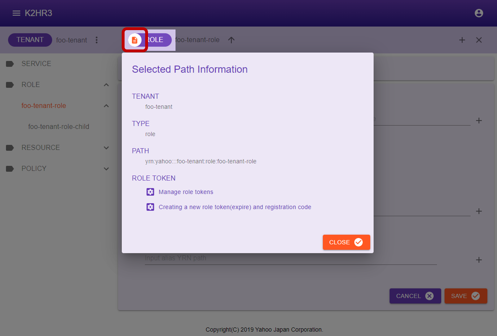
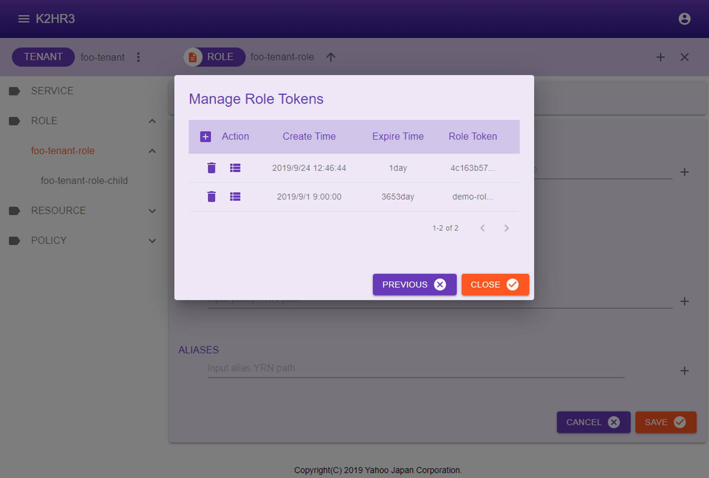
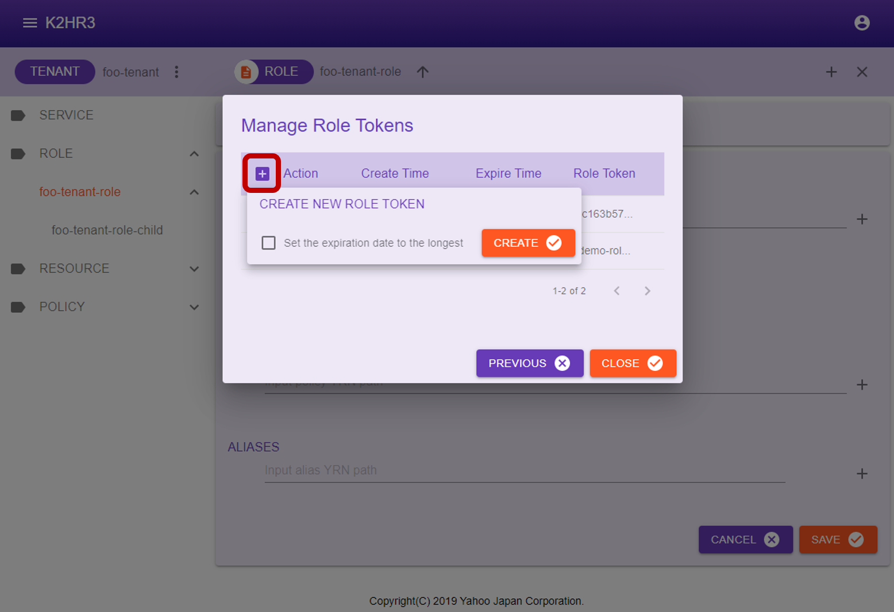
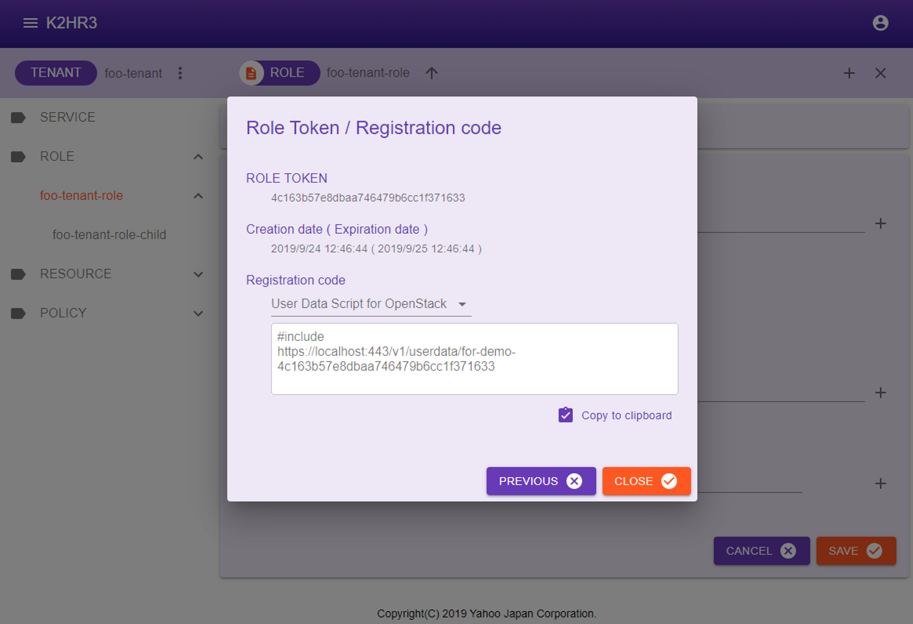
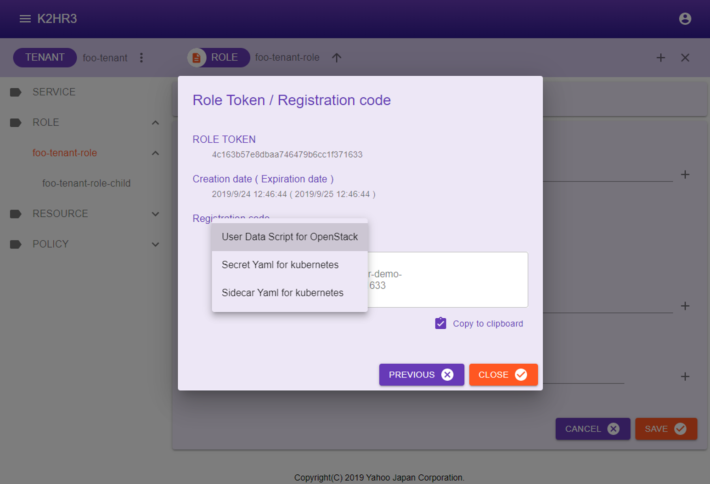
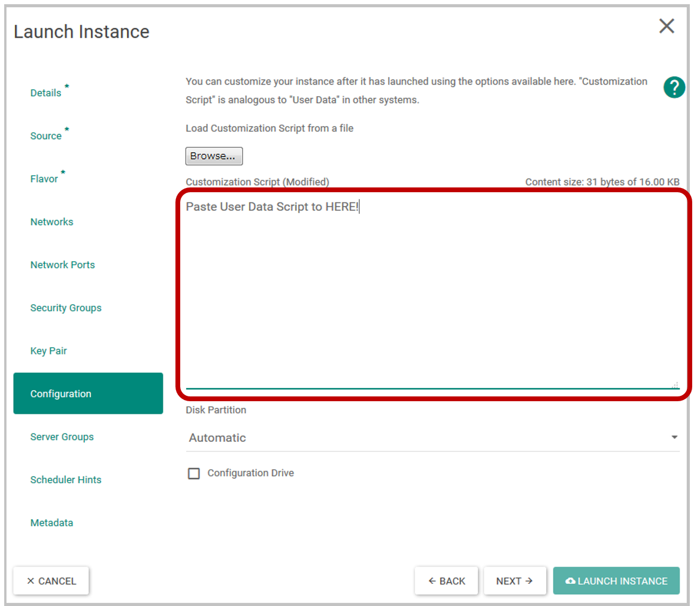

# ROLE Usage for K2HR3 Web Application
This section explains how to operate **ROLE** using the **K2HR3 Web Application**.

## Display of ROLE
If **ROLE** has not yet been registered in **TENANT**(when using the K2HR3 system for the first time), registration of **ROLE** is required first.  
If **ROLE** data already exists, you can check registered **ROLE** by selecting **ROLE** in the **left tree**.  


## Registering ROLE
To register ROLE, select **ROLE** in the **left tree**, then click the  button next to **[ROLE]** at the top.  
To register a **hierarchical ROLE**(ROLE with parent), select the **existing ROLE to be made a parent** from the left tree and click the button.  

After clicking the button, a dialog for registering ROLE is displayed.  



Enter the **ROLE name** in the displayed dialog and click the  button to register ROLE.  

Items displayed in dialog and their contents are shown below.  
- TENANT  
The **TENANT name** for registering ROLE is displayed.
- TYPE  
**"role"** indicating that it is ROLE is displayed.
- PARENT PATH  
**[YRN](detail_various.html) path** of the parent of ROLE to be registered is displayed.  
In the case of ROLE of top level(without parent) which is not layered, **"/"** is displayed.  
When registering under the parent ROLE, **[YRN](detail_various.html) path** of its parent ROLE is displayed.  
For example, if you register ROLE under the ROLE name **"toplevel"**, **"/toplevel"** is displayed.
- CREATE PATH  
Enter the name of the ROLE to be registered.

After registered **ROLE**, you can see by deploying **ROLE** in the left tree.

## Editing of ROLE
To edit the contents of already registered **ROLE**, first select ROLE to edit in the left tree.  
After selection, the data of the **ROLE data** is displayed in the main area of **K2HR3 Web Application**.  

You can directly edit, add, or delete this ROLE data.  
After editing, you can save the ROLE data by clicking the  button.
To discard the editing, please click the  button.  



After selecting ROLE, the items displayed in the main area will be explained.  
- HOST NAMES  
The HOST expressed by the **FQDN(hostname)** registered as a member of ROLE is enumerated.  
  - HOST NAME  
    The **FQDN**(hostname) is displayed.
  - AUX  
    Information set as [Auxiliary Information(AUX)](detail_various.html) is displayed.  
    For **AUX**, please see [Auxiliary Information (AUX)](detail_various.html).
- IP ADDRESSES  
The HOST expressed by the **IP address** registered as a member of ROLE is enumerated.  
  - IP ADDRESSE  
    The **IP address** is displayed.
  - AUX  
    Information set as [Auxiliary Information(AUX)](detail_various.html) is displayed.  
    For **AUX**, please see [Auxiliary Information (AUX)](detail_various.html).
- POLICIES  
**[YRN](detail_various.html) full path** of POLICY-RULE registered in ROLE is listed.  
Also when editing/adding POLICY-RULE, enter **[YRN](detail_various.html) full path**.
- ALIAS  
The registered ALIAS is displayed.  
ALIAS is displayed as **[YRN](detail_various.html) full path** to other ROLE.  
To edit/add as well, enter **[YRN](detail_various.html) full path**.

## Attribute information of ROLE
To display **ROLE attribute information**, first select ROLE in the left tree.  
After selection, click  on the left side of **[ROLE]** to display the ROLE attribute information(**Selected Path Information**) dialog.  
The attribute information of ROLE is displayed in this dialog.  



The following describes attribute information of ROLE.
- TENANT  
Displays the **TENANT name** to which ROLE belongs.
- TYPE  
**"role"** is displayed.
- PATH  
**[YRN](detail_various.html) full path** to this ROLE is displayed.  
This **[YRN](detail_various.html) full path** is used for input to **ROLE ALIAS** etc.
- ROLE TOKEN  
There are two buttons  for managing ROLE TOKENs and for displaying details of the ROLE TOKEN and automatically registration codes for IaaS(OpenStack and kubernetes).  
To manage ROLE TOKENs, click the  **Manage role tokens** button.  
To create a new role token and view the details of it and display the code for automatic registration to IaaS(OpenStack and kubernetes), Click the  **Creating a new role token(expire) and registration code** button.

### Manage ROLE TOKENs
Click  **Manage role tokens** button in the ROLE attribute information(**Selected Path Information**) dialog, you can manage ROLE TOKENs.  
In the **Manage Role Tokens** dialog shown below, you can check the list of ROLE TOKENs that have been issued for the target ROLE.  



This dialog has  **create a new ROLE TOKEN** button,  **delete a ROLE TOKEN** button, and  **display detail of ROLE TOKEN and automatically registration codes for IaaS(OpenStack and kubernetes)** button.  
The operation of each button is shown below.  

#### Create a new ROLE TOKEN
You can issue a new ROLE TOKEN by clicking the  **Create a new ROLE TOKEN** button.  
You can specify a new ROLE TOKEN to be either expiration date(default 24 hours) or indefinite(10 years).  
_The expiration date can be set in the K2HR3 Web Application config._  
When this button is clicked, the following pop-up is displayed.  



Click  button in this popup to create a new ROLE TOKEN.  
_Immediately after a new creation, the created ROLE TOKEN is displayed in bold at the top of the **Manage Role Tokens** dialog._

#### Delete a existing ROLE TOKEN
You can delete(disable) a ROLE TOKEN by clicking  button in the ROLE TOKEN column.

#### To display datail of ROLE TOKEN and automatically registoration codes
Click  button in the ROLE TOKEN column to display the details of ROLE TOKEN and the code for automatic registration for IaaS(OpenStack and kubernetes).

### Role Token / Registration code
 **Creating a new role token(expire) and registration code** button in the ROLE attribute information(**Selected Path Information**) dialog, or click  button on the Manage ROLE TOKENs dialog page to display this dialog page.  



The following items are displayed on this dialog page.

#### ROLE TOKEN
A ROLE TOKEN is displayed.(All character strings are displayed.)  
You can specify this TOKEN when using the [K2HR3 REST API](api.html).  
For details, please refer to [K2HR3 REST API](api.html).

#### Creation date ( Expiration date )
The date and time when the ROLE TOKEN was created and its expiration date are displayed.

#### Registration code
Displays information on the automatic registration code for IaaS(OpenStack and kubernetes) using this ROLE TOKEN.  
There are the following types of automatic registration codes to be displayed according to IaaS(OpenStack and kubernetes).  



- User Data Script for OpenStack  
**USER DATA SCRIPT** for automatic registration of OpenStack Virtual Machine(VM) is displayed.  
_This usage is described below._
- Secret Yaml for kubernetes  
When registering kubernetes Pods(Containers) automatically, the K2HR3 system requires **Secret** for kubernetes.  
The **Yaml** contents which is a template for registering this **Secret** is displayed.  
You can modify this yaml template according to the environment and register **Secret**.  
_This usage is described below._
- Sidecar Yaml for kubernetes  
When registering kubernetes Pods(Containers) automatically, the K2HR3 system runs a lightweight **Sidecar** dedicated to K2HR3 on Pods.  
The **Yaml** contents is displayed as a template to register this **Sidecar**.  
You can modify this yaml template according to the environment and start **Sidecar**.  
_This usage is described below._

### How to use USER DATA SCRIPT for OpenStack
This section describes how to automatically register an OpenStack Virtual Machine(VM) as a ROLE member.  
You can display **USER DATA SCRIPT** by selecting **User Data Script for OpenStack** on the **Role Token / Registration code** dialog page described above.  
This **USER DATA SCRIPT** can be copied using the  **Copy to Clipboard** button.  

Specify this **USER DATA SCRIPT** when launching an OpenStack Virtual Machine(VM).  
As a result, when the Virtual Machine(VM) starts up, its IP address is registered as a member of this ROLE automatically.  
The following is a dialog for specifying **USER DATA SCRIPT** of OpenStack. (The page varies slightly depending on the version of OpenStack.)  



### How to use Yaml templates for kubernetes
This section explains how to automatically register kubernetes Pods(Containers) as ROLE members.  
Select **Secret Yaml for kubernetes** and **Sidecar Yaml for kubernetes** in **Role Token / Registration code** dialog page above and copy their yaml contents.  
You can copy these Yaml templates with the  **Copy to Clipboard** button.  

#### Secret Yaml template
The yaml contents displayed in **Secret Yaml for kubernetes** is a sample(template) code for registering **k2hr3-secret** as **Secret** in kubernetes.  
In K2HR3 system, ROLE TOKEN is stored in **Secret** of kubernetes.  
The following yaml code is displayed. You can modify **namespace** etc. according to your environment, and create **Secret** using kubectl etc.  
```
apiVersion: v1
kind: Secret
metadata:
  name: k2hr3-secret
  namespace: <input your name space>
type: Opaque
data:
  K2HR3_ROLETOKEN: ****************************************************
```
The following is an example of a command that creates **Secret**.  
```
$ kubectl create --save-config -f secret.yaml
```

#### Sidecar Yaml template
The contents displayed in **Sidecar Yaml for kubernetes** is a sample(template) code for starting **Sidecar** dedicated to K2HR3 when kubernetes Pods(Containers) is started.  
** Sidecar** dedicated to K2HR3 registers **k2hr3-volume** as **volume** and runs **k2hr3-sidecar** as **sidecar container**.  

You can modify this yaml template code to suit your environment and use it to run Pods(Conatiners).  
The yaml template code contains the minimum necessary K2HR3 specific **Sidecar** yaml code.  
** Sidecar** for K2HR3 uses **docker.io/antpickax/k2hr3.sidecar** image which is minimum ALPINE image.

If you can create **Secret** and run **Sidecar** for K2HR3, kubernetes Pods(Containers) will automatically be registered as members of this ROLE.
