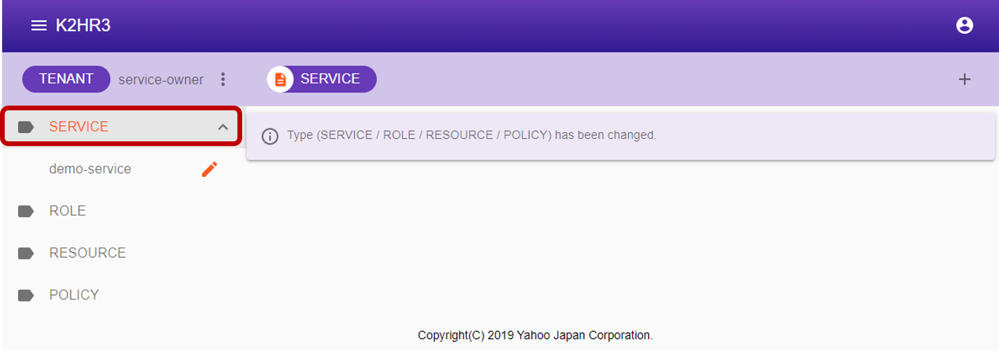
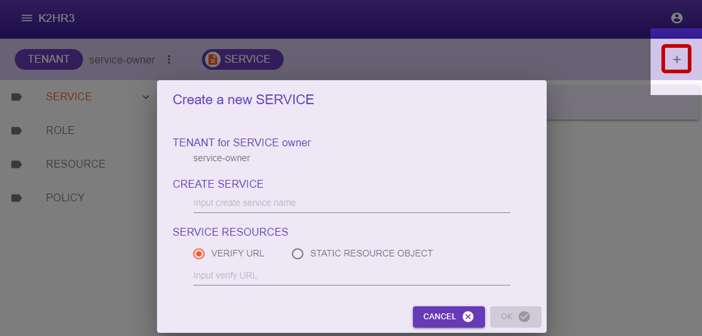
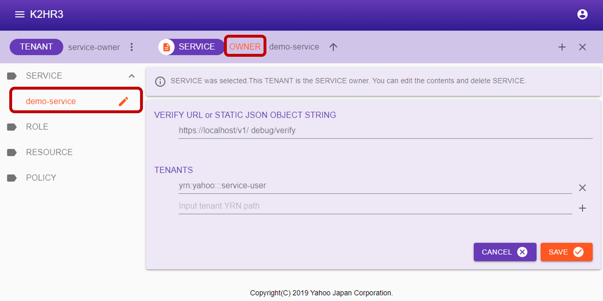
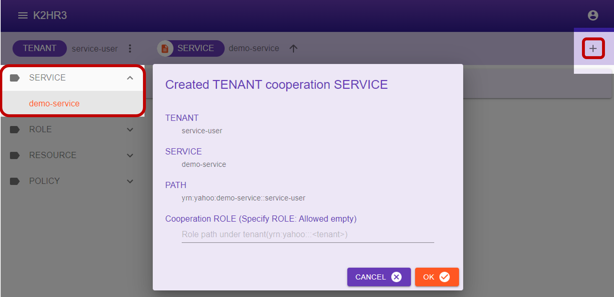
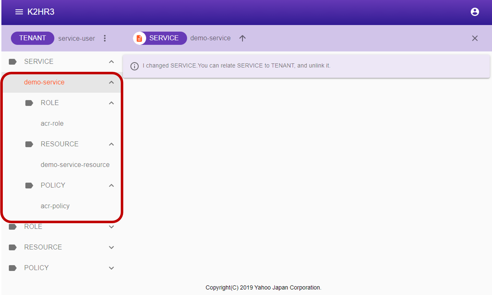
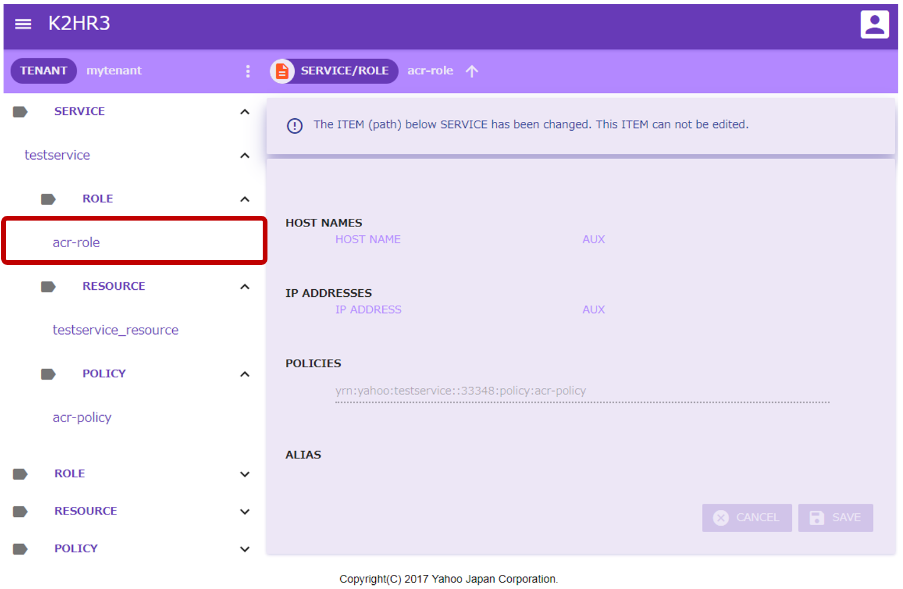
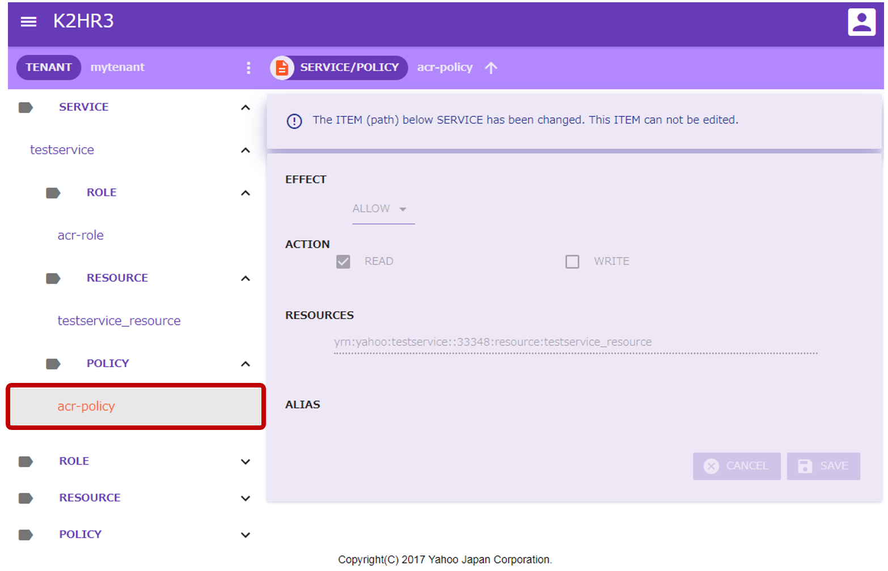
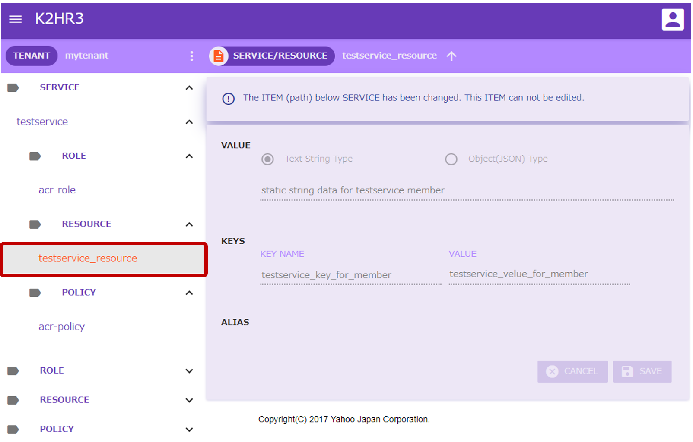
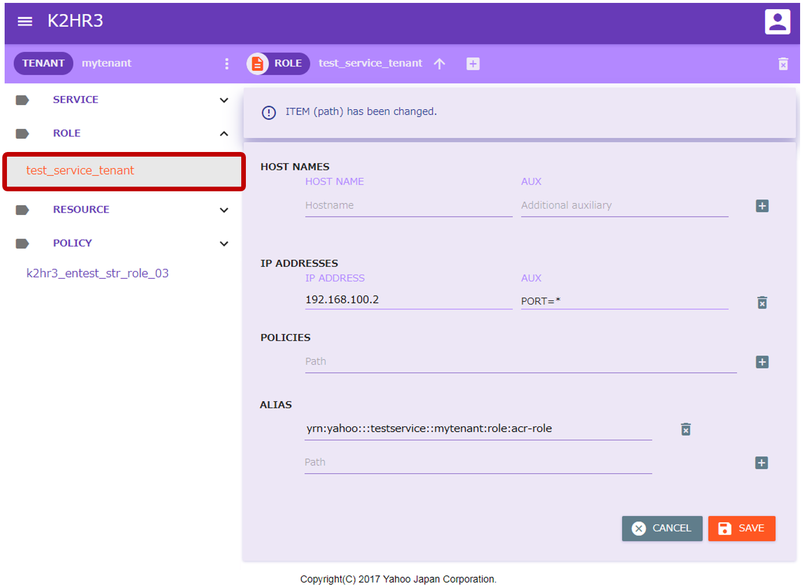
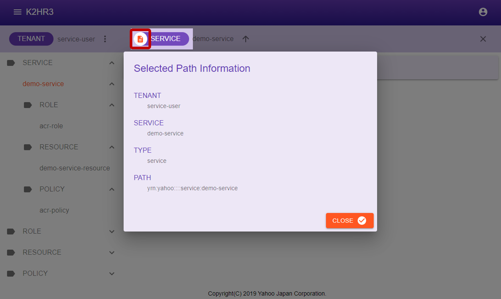

# サービス（SERVICE）
K2HR3 Webアプリケーションでのサービス（SERVICE）操作の説明をします。

## サービス（SERVICE）の表示
テナント（TENANT）にまだサービス（SERVICE）が登録・連携されていない場合（初めてK2HR3システムを利用する場合など）、まずサービス（SERVICE）の登録・連携が必要となります。  
すでにサービス（SERVICE）が登録されている場合、左側ツリー表示の中の**SERVICE**を選択することで、登録・連携済みのサービス（SERVICE）を見ることができます。  

### SERVICE所有側（OWNER）

### SERVICE利用側（MEMBER）

## サービス（SERVICE）の登録
サービス（SERVICE）のリソース（RESOURCE）を提供する所有側（OWNER）としてサービス（SERVICE）を登録します。  
登録するためには、左側ツリー中の**SERVICE**を選択した後、上部の**[SERVICE]**横の   ボタンをクリックします。  
サービス（SERVICE）登録用のダイアログが表示されます。  

表示されたダイアログにサービス（SERVICE）名と、サービス（SERVICE）のリソース（RESOURCE）を入力し、   ボタンをクリックすれば、サービス（SERVICE）が登録されます。  
サービス（SERVICE）のリソース（RESOURCE）は、静的リソース（RESOURCE）もしくは動的リソース（RESOURCE）としてVERIFY URLを入力します。  
ダイアログに表示される項目とその内容を以下に示します。  
- TENANT for SERVICE owner  
サービス（SERVICE）を登録する所有側（OWNER）のテナント（TENANT）名が表示されます。
- CREATE SERVICE  
登録するサービス（SERVICE）名を入力します。
- VERIFY URL or STATIC RESOURCE  
サービス（SERVICE）のリソース（RESOURCE）を入力します。  
静的リソース（RESOURCE）を登録する場合、JSON文字列でリソース（RESOURCE）を指定します。  
動的リソース（RESOURCE）を登録する場合、VERIFY URLを指定します。  
登録するリソース（RESOURCE）のJSON文字列の内容については、[**+サービス**（**+SERVICE**）機能の使い方](usage_serviceja.html)を参照してください。

所有者（OWNER）として登録したサービス（SERVICE）は、左側ツリーの**SERVICE**を展開することで確認できます。  
所有者（OWNER）であるサービス（SERVICE）の場合には、サービス（SERVICE）名の横に   アイコンが表示されます。  

## 登録したサービス（SERVICE）の編集
所有者（OWNER）として登録したサービス（SERVICE）の内容を編集できます。  
まず、所有者（OWNER）であるサービス（SERVICE）を左側ツリーで選択します。  
選択後、メインの画面エリアに所有者（OWNER）が管理できるサービス（SERVICE）の情報が表示されます。  
表示されている内容を編集、およびデータの追加をします。  
編集後は、   ボタンをクリックし、その内容を保存します。  
編集を破棄する場合は、   ボタンをクリックしてください。  

所有者（OWNER）のサービス（SERVICE）選択後のメインの画面エリアに表示される項目について説明します。
- VERIFY URL or STATIC JSON OBJECT STRING  
サービス（SERVICE）のリソース（RESOURCE）が表示されます。  
静的リソース（RESOURCE）を入力する場合、JSON文字列でリソース（RESOURCE）を指定します。  
動的リソース（RESOURCE）を入力する場合、VERIFY URLを指定します。  
リソース（RESOURCE）のJSON文字列の内容については、[**+サービス**（**+SERVICE**）機能の使い方](usage_serviceja.html)を参照してください。
- TENANTS  
サービス（SERVICE）の利用側（MEMBER）として登録されているテナント（TENANT）が列挙されます。  
テナント（TENANT）を追加・削除することができます。  
追加する場合には、テナント（TENANT）を**[YRN](detail_variousja.html)フルパス**で指定してください。

## サービス（SERVICE）の連携
所有側（OWNER）により提供されているサービス（SERVICE）を利用側（MEMBER）として連携します。  
連携する前に、連携するテナント（TENANT）をそのサービス（SERVICE）の利用側（MEMBER）として、所有側（OWNER）に登録してもらってください。  

サービス（SERVICE）の利用者（MEMBER）として登録されているテナント（TENANT)を選択します。  
テナント（TENANT）選択後、左側ツリー中の**SERVICE**を選択し、連携を行うサービス（SERVICE）名がリストされていることを確認してください。  
目的の連携するサービス（SERVICE）が存在すれば、それを選択します。  
選択後、上部の**[SERVICE] <service name>**横の   ボタンをクリックします。  
サービス（SERVICE）の連携用のダイアログが表示されます。  

表示されたダイアログの   ボタンをクリックすることでサービス連携が完了します。  
このとき、初期でサービス（SERVICE）に連携させるためのロール（ROLE）を一つ指定することができます。  
初期ロール（ROLE）を指定する場合には、入力してから   ボタンをクリックしてください。  

ダイアログに表示される項目とその内容を以下に示します。  
- TENANT  
サービス（SERVICE）を連携させるテナント（TENANT）名を表示します。
- SERVICE  
連携させるサービス（SERVICE）名を表示します。
- PATH  
連携させた場合のサービス（SERVICE）への**[YRN](detail_variousja.html)フルパス**が表示されます。  
この**[YRN](detail_variousja.html)フルパス**は、サービス（SERVICE）と連携させたテナント（TENANT）を含むパスとなっています。
- 初期連携ROLE  
連携させる時に一緒に登録するロール（ROLE）への**[YRN](detail_variousja.html)フルパス**を指定します。  
初期でロール（ROLE）を登録しない場合には、未入力のままにしてください。  
_ロール（ROLE）の追加は連携後でも可能です。_

利用側（MEMBER）として登録したサービス（SERVICE）は、左側ツリーの**SERVICE**を展開することで確認できます。  
利用側（MEMBER）であるサービス（SERVICE）の場合には、サービス（SERVICE）名の横に   アイコンは**表示されていません**。  

## 連携したサービス（SERVICE）の内容
利用側（MEMBER）として連携したサービス（SERVICE）の内容を表示させることができます。  
まず、利用側（MEMBER）であるサービス（SERVICE）を左側ツリーで選択します。  
選択後、そのサービス（SERVICE）以下に、ロール（ROLE）、ポリシー/ルール（POLICY）、リソース（RESOURCE）のサブアイテムが表示されます。  

それぞれの内容を以下に説明します。

### 連携したサービス（SERVICE）のロール（ROLE）
連携したサービス（SERVICE）のロール（ROLE）には、**acr-role**のみが存在します。  
このロール（ROLE）を選択すると、メインの画面エリアでその内容を確認することができます。  
_この内容は、編集できません。_  
**acr-role**には、ポリシー/ルール（POLICY）のみが登録されています。  
その値は連携したサービス（SERVICE）のポリシー/ルール（POLICY）に一つだけ存在する**acr-policy**への**[YRN](detail_variousja.html)フルパス**となっています。

### 連携したサービス（SERVICE）のポリシー/ルール（POLICY）
連携したサービス（SERVICE）のポリシー/ルール（POLICY）には、**acr-policy**のみが存在します。  
このポリシー/ルール（POLICY）を選択すると、メインの画面エリアでその内容を確認することができます。  
_この内容は、編集できません。_  
**acr-policy**には、所有者（OWNER）が設定した効果（EFFECT）、アクセス方法（ACTION）が設定されています。  
また、RESOURCESとしてリソース（RESOURCE）が一つだけ登録されており、連携したサービス（SERVICE）のリソース（RESOURCE）が列挙されています。

### 連携したサービス（SERVICE）のリソース（RESOURCE）
連携したサービス（SERVICE）のリソース（RESOURCE）には、所有者（OWNER）が提供するリソース（RESOURCE）が1つ以上存在します。  
これらのリソース（RESOURCE）は、所有者（OWNER）がサービス（SERVICE）に設定した静的、動的リソース（RESOURCE）です。  
個々のリソース（RESOURCE）を選択すると、メインの画面エリアでその内容を確認することができます。  
_この内容は、編集できません。_  

## サービス（SERVICE）に紐づくロール（ROLE）
利用側（MEMBER）として連携したサービス（SERVICE）に紐付けられたロール（ROLE）の確認をします。  
初期で登録したロール（ROLE）が存在する場合、もしくは後から追加したロール（ROLE）を左側ツリーで選択します。  

選択後、メインの画面エリアにそのロール（ROLE）の内容が表示されます。  

このロール（ROLE）のエリアス（ALIAS）に連携したサービス（SERVICE）に唯一存在する**acr-role**への**[YRN](detail_variousja.html)フルパス**が登録されています。  

利用側（MEMBER）としてサービス（SERVICE）連携し、紐付けたロール（ROLE）には上述のようにサービス（SERVICE）の**acr-role**ロール（ROLE）がエリアス（ALIAS）として登録されています。  

### サービス（SERVICE）にロール（ROLE）を紐付け
利用側（MEMBER）として連携したサービス（SERVICE）にロール（ROLE）を紐付けるには、まず紐付けるロール（ROLE）を作成します。  
ロール（ROLE）を作成したら、そのロール（ROLE）のエリアス（ALIAS）に、連携したサービス（SERVICE）の**acr-role**ロール（ROLE）への**[YRN](detail_variousja.html)フルパス**を登録します。  
登録するだけで紐付けが完了します。

### サービス（SERVICE）からロール（ROLE）紐付けを削除
利用側（MEMBER）として連携したサービス（SERVICE）に紐付けられたロール（ROLE）を削除する操作を説明します。
紐付けられたロール（ROLE）のエリアス（ALIAS）に存在する連携したサービス（SERVICE）の**acr-role**ロール（ROLE）を削除してください。
エリアス（ALIAS）から削除するだけで完了します。

## サービス（SERVICE）の属性情報
サービス（SERVICE）の属性情報を表示するには、まずサービス（SERVICE）を左側ツリーで選択します。  
_所有側（OWNER）、利用側（MEMBER）で属性情報を表示する方法は同じです。_  
選択後、上部の**[SERVICE]**左横の  をクリックし、サービス（SERVICE）の属性情報（Selected Path Information）ダイアログを表示します。  
このダイアログに、サービス（SERVICE）の属性情報が表示されます。  

サービス（SERVICE）の属性情報について説明します。
- TENANT  
サービス（SERVICE）が属しているテナント（TENANT）名を表示します。  
同じサービス（SERVICE）であっても所有側（OWNER）と利用側（MEMBER）で属しているテナント（TENANT）が異なるため、それぞれのテナント（TENANT）名が表示されます。
- SERVICE  
サービス（SERVICE）名を表示します。  
所有側（OWNER）と利用側（MEMBER）で同じサービス（SERVICE）名です。
- TYPE  
"service"と表示します。
- PATH  
このサービス（SERVICE）への**[YRN](detail_variousja.html)フルパス**を表示します。  
所有側（OWNER）と利用側（MEMBER）で同じ**[YRN](detail_variousja.html)フルパス**です。

