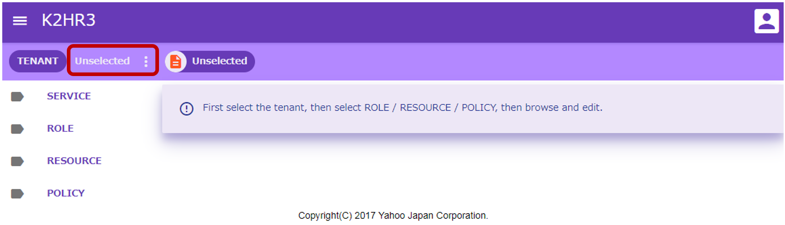
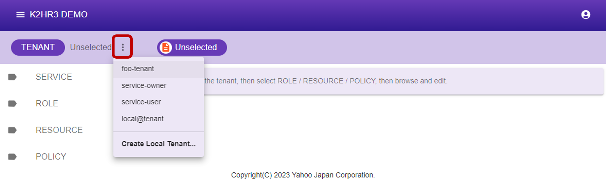
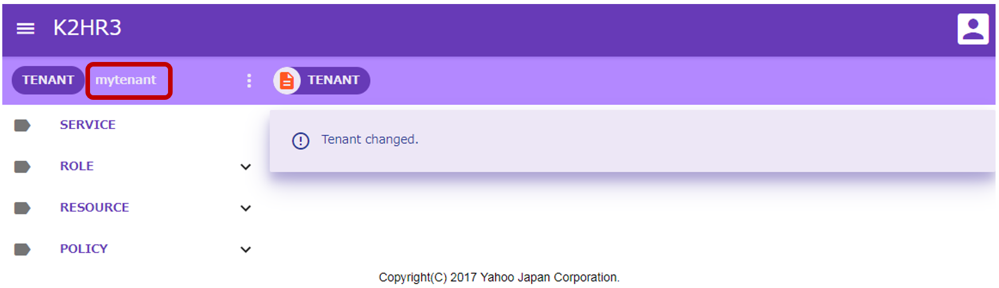

# テナント（TENANT）
K2HR3 Webアプリケーションで使用するテナント（TENANT）の操作の説明をします。

### テナント（TENANT）について
K2HR3システムは、OpenStackもしくは他のユーザ認証システムと連携して動作できます。  
OpenStackと連携している場合、K2HR3のテナント（TENANT）は、IaaS（OpenStack）にてユーザ（USER）が属しているテナント（もしくはプロジェクト）のことを指します。  
ユーザ認証システムと連携している場合は、その認証システムでユーザ（USER）が属している（スコープされた）グループを指します。

## テナント（TENANT）の選択
K2HR3 Webアプリケーションにアクセスし、サインインした直後、以下の画面が表示されます。  

リソース（RESOURCE）、ポリシー/ルール（POLICY）、ロール（ROLE）、サービス（SERVICE）の操作をするためには、まずこれらが属するテナント（TENANT）を選択する必要があります。  
以下の手順で、テナント（TENANT）を選択します。  
1. テナント（TENANT）を選択するには、**[TENANT] Unselected**と表示されている横のボタン  をクリックします。
1. サインインしているユーザ（USER）が属しているテナント（TENANT）の一覧が表示されます。
1. いずれかのテナント（TENANT）を選択します。

テナント（TENANT）が選択されると、そのテナント（TENANT）に登録されているリソース（RESOURCE）、ポリシー/ルール（POLICY）、ロール（ROLE）、サービス（SERVICE）の情報が表示され、利用できるようになります。

