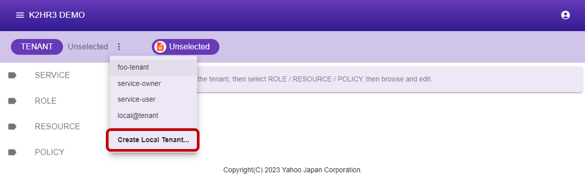
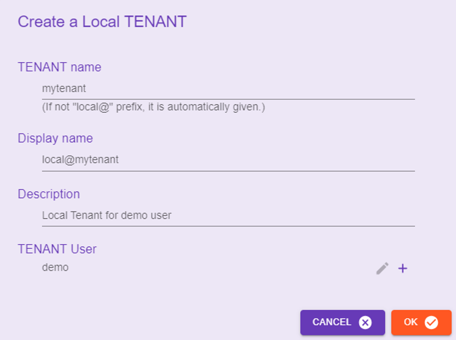
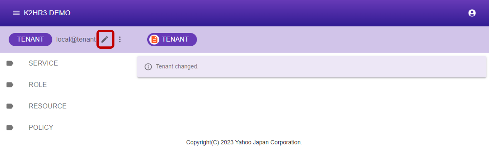

# テナント（TENANT）
K2HR3 Webアプリケーションで使用するテナント（TENANT）の操作の説明をします。

### テナント（TENANT）について
K2HR3システムは、OpenStackもしくは他のユーザ認証システムと連携して動作できます。  
OpenStackと連携している場合、K2HR3のテナント（TENANT）は、IaaS（OpenStack）にてユーザ（USER）が属しているテナント（もしくはプロジェクト）のことを指します。  
Kubernetsと連携している場合、K2HR3のテナント（TENANT）は、IaaS（Kubernetes）にてユーザ（USER）が属している Namespace のことを指します。  
これ以外にK2HR3 システム内で利用するローカルテナント（LOCAL TENANT）を作成でき、利用できます。  
ユーザ認証システムと連携している場合は、その認証システムでユーザ（USER）が属している（スコープされた）グループを指します。  

## テナント（TENANT）の選択
K2HR3 Webアプリケーションにアクセスし、サインインした直後、以下の画面が表示されます。  


リソース（RESOURCE）、ポリシー/ルール（POLICY）、ロール（ROLE）、サービス（SERVICE）の操作をするためには、まずこれらが属するテナント（TENANT）を選択する必要があります。  
以下の手順で、テナント（TENANT）を選択します。  
1. テナント（TENANT）を選択するには、**[TENANT] Unselected**と表示されている横のボタン  をクリックします。
1. サインインしているユーザ（USER）が属しているテナント（TENANT）の一覧が表示されます。
1. いずれかのテナント（TENANT）を選択します。


テナント（TENANT）が選択されると、そのテナント（TENANT）に登録されているリソース（RESOURCE）、ポリシー/ルール（POLICY）、ロール（ROLE）、サービス（SERVICE）の情報が表示され、利用できるようになります。


## ローカルテナント（LOCAL TENANT）
K2HR3システムは、連携しているIaaS（OpenStackもしくはKubernetes）が提供するテナント（TENANT）以外のローカルテナント（LOCAL TENANT）を利用できます。  
このローカルテナントの作成・編集・削除について説明します。  

### ローカルテナント利用設定
ローカルテナント（LOCAL TENANT）を利用するには、K2HR3 Web Application および K2HR3 REST API のサーバ設定が必要です。  
それぞれのサーバ設定（コンフィグレーション）にて、以下の値を `true` に設定してください。  
_デフォルトは`true`となっているので、通常ローカルテナント（LOCAL TENANT）を使用しない場合のみ `false`を設定します。_

- K2HR3 Web Application（例：config/default.json）  
```
{
    ...
    'uselocaltenant': true,
    ...
}
```

- K2HR3 REST API（例：config/default.json）  
```
{
    ...
    'localtenants': true,
    ...
}
```

### ローカルテナント作成
ローカルテナント（LOCAL TENANT）は自由に作成できます。  
テナント選択メニューの最終行にある ** ローカルテナント新規作成 ** メニューを選択します。  



#### ローカルテナント新規作成ダイアログ
ローカルテナント（LOCAL TENANT）の新規作成ダイアログを以下に示します。  



このダイアログに必要項目を入力し、**OK** ボタンをクリックするとローカルテナントが作成されます。  
各入力項目を以下に説明します。  

##### テナント名
ローカルテナント（LOCAL TENANT）の名前を入力します。  
この値は、他のテナント名と重複することはできません。  
ローカルテナント（LOCAL TENANT）の名前は、** local@ ** プレフィックスで開始されている必要があります。  
** local@ ** プレフィックスが指定されていない場合、自動的に付与されます。  

##### 表示名
ローカルテナント（LOCAL TENANT）を K2HR3 Web Application で表示するときの文字列を指定します。  
この値は、省略可能であり、省略時はローカルテナント（LOCAL TENANT）の名前と同じになります。  

##### 説明
ローカルテナント（LOCAL TENANT）の補足説明を入力します。  
この値は、省略可能です。

##### ユーザ
ローカルテナント（LOCAL TENANT）にアクセス可能なユーザ（USER）を指定します。  
ユーザ（USER）の追加・削除をこのダイアログ内のボタンで操作できます。  
新規作成時は、自分自身のユーザ（USER）名が自動的に追加され、自分自身を削除することはできません。  

### ローカルテナント編集
ローカルテナント（LOCAL TENANT）の情報を編集できます。  

ローカルテナント（LOCAL TENANT）を選択した状態で、そのテナント名横の編集ボタンをクリックします。  



#### ローカルテナント編集ダイアログ
ローカルテナント（LOCAL TENANT）の編集ダイアログを以下に示します。  


このダイアログで各項目の編集ができます。  
また、ローカルテナント（LOCAL TENANT）の削除もこのダイアログから行います。  

##### テナント名
この項目は、編集することはできません。

##### テナントID
この項目は、編集することはできません。

##### 表示名
ローカルテナント（LOCAL TENANT）を K2HR3 Web Application で表示するときの文字列を指定します。  
この値を空にした場合、ローカルテナント（LOCAL TENANT）の名前と同じになります。  

##### 説明
ローカルテナント（LOCAL TENANT）の補足説明を入力します。  
この値には空を設定できます。

##### ユーザ
ローカルテナント（LOCAL TENANT）にアクセス可能なユーザ（USER）を追加・編集・削除できます。  
自分自身のユーザ（USER）を削除した場合、ローカルテナント（LOCAL TENANT）にアクセスできなくなります。  
すべてのユーザ（USER）を削除した場合、ローカルテナント（LOCAL TENANT）が完全に削除されます。  

### ローカルテナント削除
ローカルテナント（LOCAL TENANT）の削除は、ローカルテナント編集ダイアログで行います。

ローカルテナント編集ダイアログ を起動し、ローカルテナント（LOCAL TENANT）の全ユーザ（USER）を削除してください。  
これにより、ローカルテナント（LOCAL TENANT）が完全に削除できます。
