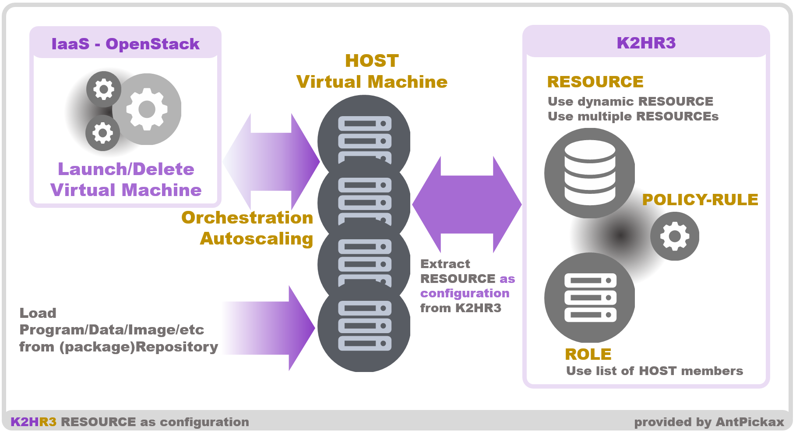
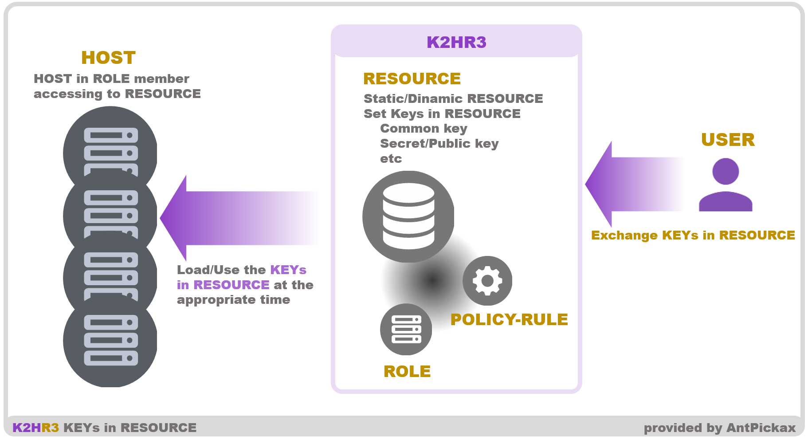

# その他の使い方
K2HR3システムを使ったその他の使い方を紹介します。  

## オーケストレーション対応
K2HR3システムは、オーケストレーション/オートスケール対応を簡単にする手段を提供できます。  

オーケストレーション（オートスケール）に対応するには、配置・再配置されるプログラム（アプリケーション）とそれらが管理するデータなどが自動的にスケールできる必要があります。  
プログラム（アプリケーション）が管理している動的なデータのスケールは、それ自身などで対応する必要があります。  
しかし、K2HR3システムはプログラム（アプリケーション）自身とこれらの起動に必要となる設定（コンフィグレーション）を状況・状態・環境に応じてサポートすることができます。  
その事例・使い方を説明します。

### プログラムの設定を配布
オーケストレーション（オートスケール）で対応させられるプログラム（アプリケーション）は、状況・状態・環境に応じた設定（コンフィグレーション）が必要となるケースがあります。  
この設定（コンフィグレーション）を都度作成し、一緒に配布するような運用を行うと、スケールはできるが、オートではない状態となりがちです。  

K2HR3システムでリソース（RESOURCE）の動的な生成を行うことで、状況・状態・環境に応じた設定（コンフィグレーション）を配布できます。  
つまり、オートスケールされたプログラム（アプリケーション）はパッケージから実行形式のみを配布し、その実行のための設定（コンフィグレーション）はK2HR3システムからリソース（RESOURCE）として読み出すようにできます。  

リソース（RESOURCE）の動的な生成には、K2HR3 テンプレートエンジンに対応したテンプレート（TEMPLATE）で記述したリソース（RESOURCE）を登録するだけです。  
テンプレート（TEMPLATE）では、K2HR3システムのアクセス許可されたすべてのロール（ROLE）、リソース（RESOURCE）、条件文、四則演算が可能であり、設定（コンフィグレーション）の作成ができます。  



このように動的リソース（RESOURCE）を定義し、これを使うことでオーケストレーション（オートスケール）の対応を簡単にできます。  
言い換えると、設定（コンフィグレーション）情報を配布するサーバーを準備しなくても、RBAC付きでK2HR3システムを利用することができます。

#### ホスト（HOST）を列挙
IaaS（OpenStack、kubernetes）などを使いインスタンスやポッド/コンテナーとしてホスト（HOST）を起動している場合、動的にホスト（HOST）が変化します。  
オーケストレーション（オートスケール）では、特に顕著であり、ユーザ（USER）が意識せず、この事象が発生します。  
プログラム（アプリケーション）やシステムが、ホスト（HOST）の集合に依存している場合、この変化を自動的に捉え、反映する必要があります。  

上述の使い方で説明していますが、この課題となるホスト（HOST）の集合を動的に列挙することがK2HR3システムを使うことで可能です。  
このような使い方が必要となるケースの場合、K2HR3を使うことを推奨します。

## 鍵の動的な配布
他のシステムにアクセスするために、鍵（共通鍵、公開鍵、秘密鍵等）を使うプログラム（アプリケーション）があります。  
このようなプログラム（アプリケーション）に対して、鍵が変更となった場合、更新する場合などのケースを考えてみます。  

一般的には、鍵を再配布し、プログラム（アプリケーション）を再起動する等を行います。  
この配布の処理をK2HR3システムを使い簡単にすることができます。  

+サービス（+SERVICE）機能を使い、サービス（SERVICE）の所有側（OWNER）が利用側（MEMBER）に対して、鍵をリソース（RESOURCE）として登録することができます。  
これにより、鍵を所有側（OWNER）のタイミングで更新・変更・追加などできるようになります。  



プログラム（アプリケーション）もしくはそれを含むシステムが、鍵の変更を検知し、再起動もしくは再読み込みを行うことが可能であれば、所有側（OWNER）は利用側（MEMBER）に配慮せず、鍵の入れ替えができます。  
鍵の配布・更新などのシステムを別途準備することも可能ですが、+サービス（+SERVICE）機能のように連携機能・RBAC機能を同時に持ち、IaaS（OpenStackやkubernetes）にも連動するように準備するのはコストがかかります。  
これらとの連携・RBAC・連動が可能なK2HR3システムを使うことで、コストの低減・安全な導入ができます。

## 自動登録・削除時の追加処理
OpenStackで仮想コンピューティング（Virtual Machine）の自動登録・削除をするとき、パッケージのインストールと、Systemdサービスの開始・停止ができます。

### OpenStackにおける自動登録時の処理
OpenStackで仮想コンピューティング（Virtual Machine）の自動登録を行うとき、同時にパッケージのインストールと、Systemdサービスの開始ができます。  
この処理を行うためには、仮想コンピューティング（Virtual Machine）を登録するロール（ROLE）に対応したリソース（RESOURCE）にパッケージ名、Systemdサービス名を指定しておきます。  

例えば、登録先のロール（ROLE）が以下のYRNパスだとします。  
```
yrn:yahoo:::mytenant:role:myhosts
```
この場合、以下のYRNパスのリソース（RESOURCE）のKEYSデータにパッケージ名、Systemdサービス名を列挙できます。
```
yrn:yahoo:::mytenant:resoruce:myhosts
```
- k2hr3-init-packages  
このキー（KEY）の値に、インストールするパッケージ名を列挙します。（セパレーターは、`,`で指定します。）
- k2hr3-init-packagecloud-packages  
このキー（KEY）の値に、[packagecloud.io](https://packagecloud.io/antpickax/stable)にあるAntPickaxの提供するパッケージをインストールする場合は、パッケージ名を列挙します。（セパレーターは、`,`で指定します。）
- k2hr3-init-systemd-packages  
このキー（KEY）の値に、開始したいSystemdサービス名を列挙します。

### OpenStackにおける自動削除時の処理
OpenStackで仮想コンピューティング（Virtual Machine）の削除を行うとき、同時にSystemdサービスの停止ができます。  
この処理を行うためには、仮想コンピューティング（Virtual Machine）をが登録されているロール（ROLE）に対応したリソース（RESOURCE）にSystemdサービス名を指定しておきます。  

リソース（RESOURCE）のKEYSデータは、登録時と同じ `k2hr3-init-systemd-packages` が使われます。  
つまり、登録時に起動したSystemdサービスは、削除時に自動的に停止できます。

## その他の事例
今後もこのドキュメントに事例を追加していきます。
