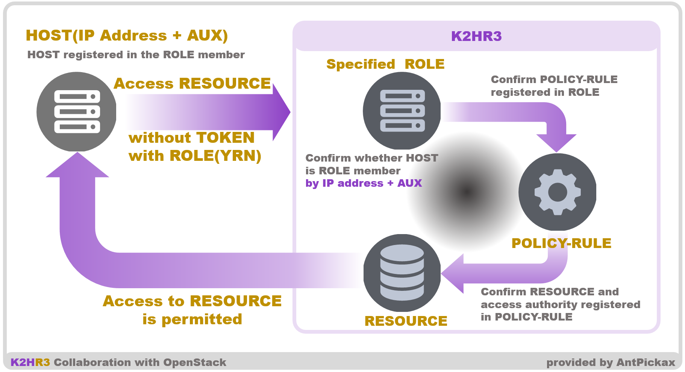
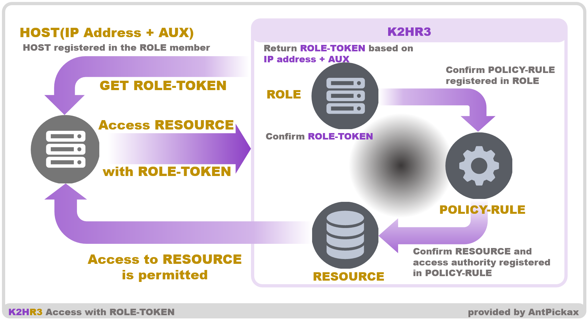
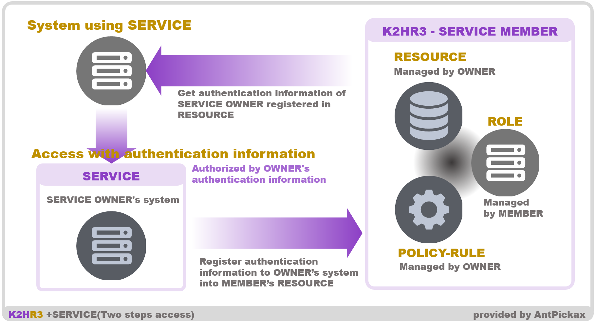
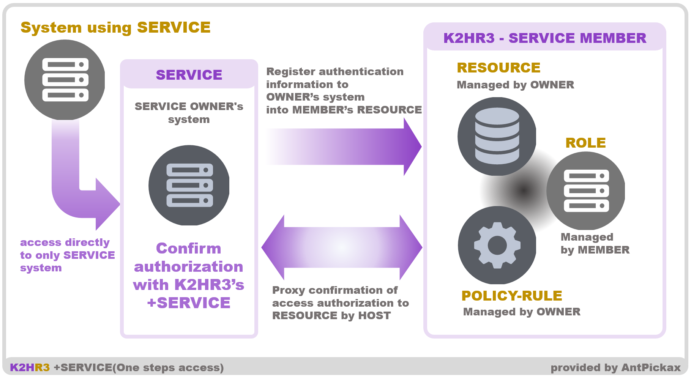

# **RBAC**(**R**ole **B**ased **A**ccess **C**ontrol) Usage
The K2HR3 system provides ROLE-based access control to RESOURCE **RBAC**(**R**ole **B**ased **A**ccess **C**ontrol).

**USER** needs to set **ROLE**, **POLICY-RULE**, **RESOURCE**, **SERVICE** in order to use the **RBAC** feature.
These settings are described in [K2HR3 Usage](usage.html).

## RBAC Overview
The access source to RESOURCE controlled as RBAC is managed by ROLE.  
The access source HOST is registered as a member in ROLE.  

Access control as RBAC is managed by POLICY-RULE.  

+SERVICE is a feature that controls access to RESOURCE owner (OWNER) and user(MEMBER) RESOURCE.  
SERVICE is data managed by the K2HR3 system used with the +SERVICE feature.  

This section explains how to use the RBAC feature of the K2HR3 system.  

### Access to RESOURCE
There are **two ways** to access RESOURCE by the K2HR3 system.  
They are access with token(TOKEN) **specified** and **unspecified** access.
TOKEN also has TOKEN granted to USER and TOKEN granted to ROLE(HOST).

For information about accessing with TOKEN to the K2HR3 system, please also refer to [REST API Usage](api.html).

## Access RESOURCE without TOKEN
RESOURCE data can be acquired without TOKEN.  
_For TOKEN, please see [REST API Usage](api.html)._  

**RESOURCE can be accessed without TOKEN** when accessing RESOURCE from the HOST of the ROLE member using the K2HR3 REST API.  

### Details
When performing access control, it is necessary to check the access authority for the access target.　　
Generally, TOKEN, IP address, cookie, etc. are used for confirmation of authority.　　
On the K2HR3 system, use the IP address(and [Auxiliary Information(AUX)](detail_various.html)) to confirm the access authority, and authenticate and authorize it.　　

The flow of this processing is shown below.　　
1. HOST attempts to access RESOURCE using the REST API
1. K2HR3 system confirms ROLE of HOST
1. Check the authority of access to RESOURCE of ROLE
1. HOST is granted access to RESOURCE and gets contents

As mentioned above, in the case of ROLE member HOST which is permitted access to RESOURCE, HOST can access RESOURCE without specifying TOKEN.  



### Examples
As shown below, HOST of ROLE member can get RESOURCE using [RESOURCE API](api_resource.html).  
```
GET http://<K2HR3 API server host[:port]/v1/resource/<RESOURCE YRN PATH>?role=<ROLE YRN PATH>&type=<TYPE>
```
The above URL arguments and others are explained below.  
- RESOURCE YRN PATH  
Specify [YRN](detail_various.html) full path of RESOURCE to be acquired.
- ROLE YRN PATH  
Specify [YRN](detail_various.html) full path of ROLE where HOST is registered.
- TYPE  
Specify the type of content of RESOURCE to be acquired.

In this way, you can use [RESOURCE API](api_resource.html) request without TOKEN and get RESOURCE.

## Access RESOURCE with TOKEN
USER can also access by giving TOKEN to RESOURCE.  
This method is almost the same as accessing RESOURCE without TOKEN, but judge the access source(ROLE) by TOKEN, not authentication/authorization by IP address.

The access method using TOKEN is equivalent to the general usage method of other RBAC systems.

For details on the REST API, please see [RESOURCE API](api_resource.html).
_ This section only describes features of the K2HR3 system. _



## +SERVICE cooperation Usage(RESOURCE delivery)
This introduce one way to provide functions and information of OWNER using **+SERVICE** feature.
In this method, **MEMBER** gets **RESOURCE** defined as **SERVICE** from the K2HR3 system before accessing OWNER's system(which provides functions and information) and passes that **RESOURCE** data to the **OWNER system**.

The schematic flow of this method is shown in the following figure.



### Flow
The flow of the above figure is as follows.

#### OWNER side
**OWNER** provides functions or information of its own system.  
In order to access this function or information, **dedicated authentication/authorization**(which is different from the authentication/authorization of RBAC provided by K2HR3 system) of OWNER's system is required.  

#### MEMBER side
MEMBER accesses OWNER's system and uses functions or information.  
In order to use this function or information, MEMBER needs **dedicated authentication/authorization** provided by OWNER as mentioned above.  

### Sequence
The flow until MEMBER can use OWNER's functions or information is explained below.  

#### Registering SERVICE
Each of OWNER and MEMBER sets up to use SERVICE.  

OWNER sets the data of **dedicated authentication/authorization** of OWNER's system to **RESOURCE** of SERVICE.  
This RESOURCE can be either static or dynamic.  
If **dedicated authentication/authorization** is a **dedicated token**(which is created/used by OWNER system), OWNER registers the **VERIFY URL** to RESOURCE as **dynamic RESOURCE**.  
**VERIFY URL**(which is REST API provided by OWNER) creates a dedicated token corresponding to MEMBER to be output as RESOURCE.  

MEMBER cooperates with SERVICE and registers HOST as an access source as a ROLE member cooperated with it.  

#### (1) MEMBER gets RESOURCE from K2HR3 system
MEMBER gets the RESOURCE of SERVICE by accessing K2HR3 system(REST API can be used without TOKEN).  
The RESOURCE that MEMBER gets is **dedicated authentication/authorization** set by OWNER.  

#### (2) MEMBER accesses OWNER system
MEMBER accesses OWNER's system with data of **dedicated authentication/authorization** that MEMBER got as RESOURCE.

### What system can cooperate with this usage
In this way, the OWNER system using the +SERVICE feature and using **dedicated authentication/authorization** was able to cooperate with.  
And MEMBER can access OWNER system **without knowing contents** of **dedicated authentication/authorization** data.  

In other words, this method has the following advantages.  
- **Dedicated authentication and authorization can be hidden in MEMBER**
- **Dedicated authentication and authorization can be changed freely for OWNER**
- **MEMBER does not need processing on tokens at all**

This usage of +SERVICE can **loosely couple** the side that provides the system to be shared with the side that uses it.  
And both sides can manage management for coordinating the system to the K2HR3 system and can manage them independently.  


## +SERVICE cooperation Usage(Delegation of authentication)
This section explains **another way** of using **+SERVICE** feature.  

MEMBER accesses the OWNER system to use the functions and information of the OWNER system.  
At this time, MEMBER accesses **only** the OWNER system.  
In the above-mentioned usage, MEMBER required SERVICE's RESOURCE data beforehand.  
However, the method described here does **not require RESOURCE** data.  
MEMBER hands over its own ROLE name etc. to OWNER and the OWNER system acquires the RESOURCE data in SERVICE from the K2HR3 system on behalf of MEMBER and uses it.  



### Flow
The flow of the above figure is as follows.

#### OWNER side
**OWNER** provides functions or information of its own system.  

MEMBER accesses the OWNER system **without** the necessary **data to authorize MEMBER**.
MEMBER will pass **only the name of ROLE** of MEMBER etc.
When OWNER system is accessed, OWNER needs to check whether MEMBER is TENANT permitted to SERVICE.
In order to confirm this, OWNER sends MEMBER information(ROLE, Peer IP address etc) to the K2HR3 system and OWNER gets RESOURCE data of SERVICE set for MEMBER.

The RESOURCE data for this MEMBER is the data registered by OWNER itself, and OWNER can confirm the identity of MEMBER by checking this data.

In this way, as **OWNER delegates authorization of MEMBER to the K2HR3 system**, and MEMBER will only access the OWNER system.

#### MEMBER side
MEMBER **only passes the ROLE name** as URL arguments and accesses the OWNER system.  

### Sequence
The flow until MEMBER can use OWNER's functions or information is explained below.  

#### Registering SERVICE
Each of OWNER and MEMBER sets up to use SERVICE.  

OWNER sets RESOURCE capable of identifying MEMBER to SERVICE.  
This resource can be either static or dynamic.  
Also, if you only want to indicate whether access is permitted to the OWNER system, you only need to set common data for all MEMBERs.  
_For example, you can just register "true"._  
Whether access is authorized is the same as meaning whether it is HOST of MEMBER cooperated with SERVICE or not and this can be determined by whether OWNER can get RESOURCE of SERVICE from K2HR3 system on behalf of MEMBER .  

MEMBER cooperates with SERVICE and registers HOST as an access source as a ROLE member working with SERVICE.  

#### (1) MEMBER access OWNER system
MEMBER accesses OWNER's system.  
At this time, MEMBER passes together the information(ROLE etc) for confirming HOST as a parameter.  
This information(ROLE etc) to pass is the same information as when accessing **without the TOKEN to the REST API** of the K2HR3 system.  
_It is also possible to pass ROLE TOKEN if the system of OWNER can be **trusted**._  

#### (2) OWNER delegates authentication
The OWNER system **delegates** the passed information(ROLE etc) and HOST information(Peer IP address) to the **K2HR3 REST API** and checks whether HOST belongs to TENANT of MEMBER cooperated with SERVICE.  
OWNER can receive RESOURCE set by OWNER from the K2HR3 REST API, if HOST belongs to TENANT of MEMBER with SERVICE cooperation.  
If HOST is not authorized, OWNER will receive an error from the K2HR3 REST API.  

After confirming the acquired RESOURCE(if necessary), the OWNER system performs its own processing and returns the result to HOST.  

### What system can cooperate with this usage
Using the **+SERVICE** feature, OWNER does not require dedicated authentication and authorization, and MEMBER can access only the OWNER system directly.  
This method is that the OWNER system **delegates MEMBER's authentication** to the K2HR3 system.  
Both OWNER and MEMBER can cooperate with RESOURCE(OWNER system functions or information) **without establishing a unique authentication and authorization system**.  

For details, this method has the following advantages.  
- **MEMBER accesses the OWNER system only once**  
_Pass the same information to the OWNER system as accessing K2HR3 REST API_
- **OWNER does not require a dedicated authentication/authorization system**  
_Authorization delegated to the K2HR3 system_
- **Both MEMBER and OWNER do not need authentication and authorization processing of token etc.**

And the biggest advantage is that OWNER **does not need to disclose** the MEMBER specific RESOURCE used internally to MEMBER.  
By doing this, OWNER can **arbitrarily change** system logic and RESOURCE freely, **keeping security high**.  

Both OWNER and MEMBER can simplify API processing, and can completely delegate authentication and authorization to the K2HR3 system.
And USER only sets the authority which is unified in the K2HR3 system.

